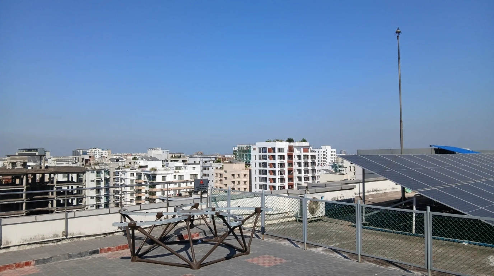

**Speaker (online):** [Dr Tim Molteno](https://www.otago.ac.nz/physics/staff/timmolteno), Electronics Research Foundation (New Zealand); Department of Physics, University of Otago (New Zealand); and Department of Physics & Electronics, Rhodes University (South Africa). Lead of the [TART Project](https://tart.elec.ac.nz/).

The talk will be delivered online at **3:00 pm Bangladesh time (9:00 pm in New Zealand)** and screened at CASSA.

## Abstract

The Transient Array Radio Telescope (TART) project has developed rapidly since the [installation workshop held at CASSA in November 2025](/news/cassa-workshop-2-innauguration). I will outline some exciting recent developments including VLBI between TART sites, new hardware designs for real-time streaming of raw data (the Software Defined Radio Telescope, or SDTART), and give an overview of some current TART research projects.

*The TART array on the rooftop of IUB, installed during the November 2025 workshop at CASSA — the first radio telescope in Bangladesh.*
