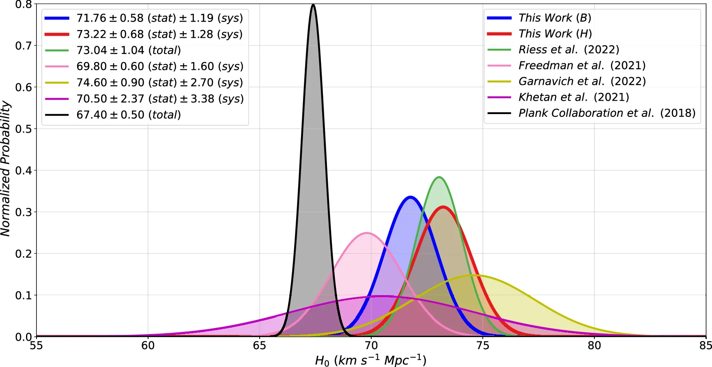

**Carnegie Supernova Project I and II: Measurements of H₀ Using Cepheid, Tip of the Red Giant Branch, and Surface Brightness Fluctuation Distance Calibration to Type Ia Supernovae**

## Abstract

Direct measurements of the local Hubble constant ($H_0$) using Type Ia supernovae (SNe Ia) yield values that are significantly higher than those inferred from the Cosmic Microwave Background (CMB), posing a notable challenge to the standard $\Lambda$CDM cosmological model. In this work, I present new results from the Carnegie Supernova Project, where we determine $H_0$ across both optical and near-infrared bandpasses ($uBgVriYJH$). We calibrate SN Ia luminosities using three independent distance indicators: Cepheid variables, Tip of the Red Giant Branch (TRGB) stars, and galaxy surface brightness fluctuations (SBF). By combining all calibrators, we obtain $H_0 = 71.76 \pm 0.58 \,\mathrm{(stat)} \pm 1.19 \,\mathrm{(sys)}$ km s$^{-1}$ Mpc$^{-1}$ in the $B$ band and $H_0 = 73.22 \pm 0.68 \,\mathrm{(stat)} \pm 1.28 \,\mathrm{(sys)}$ km s$^{-1}$ Mpc$^{-1}$ in the $H$ band. These values lessen the currently reported early- vs late-Universe $H_0$ tension when compared at the level of statistical uncertainties alone.

*Figure 9 of Syed A. Uddin et al. (2024): $H_0$ measured in this work from the $B$ band (blue) and $H$ band (red), compared with other published late-Universe measurements and the early-Universe Planck CMB value (black). © The Authors, CC BY 4.0.*

**Link:** [https://doi.org/10.3847/1538-4357/ad3e63](https://doi.org/10.3847/1538-4357/ad3e63) (ApJ 970, 72)

**Presenter:** **Syed Ashraf Uddin, PhD** (Core Member of CASSA; Associate Professor, Department of Physical Sciences, Independent University, Bangladesh) — lead author of the paper, written as part of the Carnegie Supernova Project.
