**লিখেছেন হাসান মাহমুদ সজীব, রওনক শাহরিয়ার, ও তাসনিম মাহফুজ নাফিস।**

ইনডিপেনডেন্ট ইউনিভার্সিটি, বাংলাদেশের (আইইউবি) সেন্টার ফর এস্ট্রোনমি, স্পেস সায়েন্স এন্ড এস্ট্রোফিজিক্স (কাসা)  অফিস থেকে ২টি টেলিস্কোপ সঙ্গে নিয়ে আমরা (রওনক ও নাফিস) বের হই ৯ ডিসেম্বরের সন্ধ্যায়। এদের মধ্যে একটি ছিল ইউনিস্টেলার ইকুইনক্স স্মার্ট টেলিস্কোপ, যাকে আমরা অশ্বিন-২ নামে ডাকি। অন্যটি সেলেস্ট্রন ১০০ এজেড মডেলের ম্যানুয়াল অল্ট-অ্যাজিমুথ মাউন্টের টেলিস্কোপ। মাঝে আমরা ধানমন্ডিতে কিছুটা বিরতি নিই। তারপরে কমলাপুরে রাত ১১:১৫'র চট্টগ্রাম গন্তব্যের ট্রেন তূর্ণার দিকে যাত্রা শুরু করি।

টেলিস্কোপ নিয়ে দূরের শহরে যাওয়ার সময় সাধারণত মজার অনেক ঘটনা ঘটে। ব্যাগের বহর দেখে কেউ কেউ জিজ্ঞেস করে, “আপনারা কি সংগীত শিল্পী? কনসার্টে গান গাইতে যাচ্ছেন?” টেলিস্কোপের ব্যাগের প্রতি আশপাশের কৌতূহলী চাহনি টের পাওয়া যায়। তবে এবারে আমাদের কিছুটা অন্যরকম অভিজ্ঞতা হলো। ধানমন্ডি থেকে কমলাপুরে যেতে আমরা উবার থেকে একটি  গাড়ি ভাড়া নিয়েছিলাম। সেই গাড়ির চালককে যেন জোর করে কেউ গাড়ি চালাতে পাঠিয়েছে। হঠাৎ করে সে মাঝ রাস্তায় তীব্রভাবে ব্রেক কষে, গাড়ির জানালাটা খুলে পাশের রিকশাওয়ালাকে দুটো গালি দিয়ে নেয়, তারপর জানালাটা বন্ধ করে অবিরাম হর্ন বাজাতে থাকে। পুরো যাত্রাজুড়ে এই আচরণ চলতেই থাকে। এগুলো নিয়ে তাকে কিছু বললে শক্ত মুখ করে কোন কিছু না শোনার ভঙ্গি নিয়ে গাড়ি চালাতে থাকে। এদিকে আমাদের তো ট্রেন ধরতে হবে। এতগুলো টেলিস্কোপের ব্যাগ নিয়ে আমরা হুট করে নেমে যেতেও পারছিলাম না। ফলে এই যাত্রা শেষে যখন ট্রেনে উঠে বসলাম, বেশ স্বস্তি কাজ করছিল।

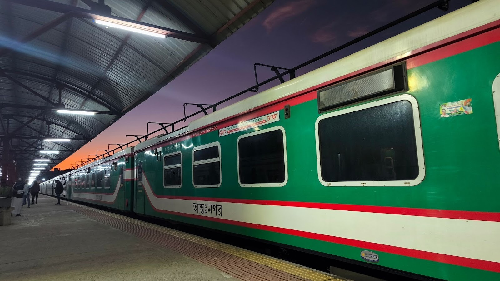

তূর্ণা ট্রেনের কিছু লাইট সারারাতই জ্বালানো থাকে। তাই ঘুম আসতে আসতেই অনেকটা সময় পেরিয়ে গেল। ঠিক ভোর সাড়ে পাঁচটায় তূর্ণা চট্টগ্রাম রেলস্টেশনের প্লাটফর্মে এসে দাঁড়াল। আধো ঘুমে টেলিস্কোপের ব্যাগগুলো নিয়ে প্ল্যাটফর্মে নামার সময় শীতের একটা ধাক্কা টের পেলাম। ঢাকায় তখন শীতের পোশাক ছাড়াই দিব্যি দিন কাটিয়ে দেওয়া যাচ্ছিল। ফলে ভোরের এই অপরিচিত শীত আমাদেরকে খানিকটা অপ্রস্তত করে দেয়। ঠিক তখনই অপূর্ব সুন্দর আভা ছড়িয়ে ভোরের প্রথম আলো ফুটতে শুরু করে। আলো-আঁধারির এই খেলার মাঝে পুব আকাশে আমরা দেখি সূর্যের সবচেয়ে কাছের গ্রহ বুধ। আর পশ্চিম আকাশে অস্ত নেওয়ার আগে আগে জ্বলজ্বল করছিল বৃহস্পতি গ্রহ। আমাদের ওইদিন রাতের আকাশ পর্যবেক্ষণের আর গল্প বলার পরিকল্পনার অন্যতম টার্গেট ছিল বৃহস্পতি। সকালেই তার সাথে আকাশের ভিন্ন এক কোণে দেখা হওয়া আমাদের আনন্দিত করে। আমরা পশ্চিম আকাশে আরো দেখা পাই পরিচিত তারা সিরিয়াস বা লুব্ধকের। হ্যারি পটার পড়তে গিয়ে ‘সিরিয়াস ব্ল্যাক’ নামক চরিত্রের সাথে পরিচয় হয় ছোটবেলায়। সিরিয়াসকে রাতের আকাশে চিনি আরো পড়ে। ফলে আকাশে সিরিয়াসকে খুঁজে পেলে প্রিয় বইয়ের কাছে ফিরে যাওয়ার অনুভূতি হয়। প্লাটফর্ম থেকে মাথা বাইরে নিয়ে উপরে আবিষ্কার করি কৃষ্ণপক্ষের আধখানা ধবল চাঁদ। অন্ধকার কমতে থাকে। পৃথিবীর ঘূর্ণনে বাংলাদেশের বন্দর নগরী সূর্যের মুখোমুখি আসতে থাকে। আকাশের সকল এস্ট্রোনমিক্যাল অব্জেক্ট সেই আলোয় মিলিয়ে যেতে শুরু করে।

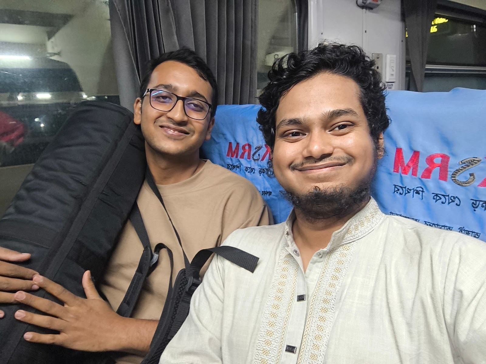

অন্যদিকে তূর্ণা চট্টগ্রামে পৌঁছানোর আগেই দূরবিন কোর ভলান্টিয়ার হাসান মাহমুদ সজীব রওনা করেছিল নাফিস ও রওনককে রিসিভ করার জন্যে।

### রওনক

চট্টগ্রাম বিশ্ববিদ্যালয়ে একটা এস্ট্রোনমি ইভেন্ট হবে, বিশাল আকারে, এই গুঞ্জন চলছিল বহুদিন ধরে। সজীব ভাই চট্টগ্রাম বিশ্ববিদ্যালয়ের অন্যতম ক্লাব, “চট্টগ্রাম বিশ্ববিদ্যালয়  রিসার্চ এন্ড হায়ার স্টাডি সোসাইটি” (সিইউআরএইচএস)-এর   সাথে বিস্তারিত আলোচনা করেন, এবং ২০২৩ এর মতো (যেখানে দূরবিনের সুপারভাইজার ড. খান আসাদও উপস্থিত ছিলেন) আরেকবার চট্টগ্রাম বিশ্ববিদ্যালয়ে বড় আকারে এস্ট্রোনমি নাইট আয়োজনের সিদ্ধান্ত হয়। তার ধারাবাহিকতায় এবারও “এস্ট্রোনমি নাইট এন্ড টক ২.০” আয়োজনের সিদ্ধান্ত আসে, যেখানে দূরবিন সহ-আয়োজক হিসেবে থাকবে৷ এবং ২ ডিসেম্বর থেকে আনুষ্ঠানিকভাবে শুরু হয় ইভেন্টের প্রস্ততি। সহ-আয়োজক হিসেবে দূরবিনের কাজ ও দায়িত্ব ছিল অনেক। সিইউআরএইচএস-এর সাথে নিয়মিত চলতে থাকে আমাদের আলোচনা। ইভেন্টে দূরবিনের সেশন, কুইজ প্রতিযোগিতা, অবজারভেশন প্ল্যান সহ বিভিন্ন দিক নিয়ে চলে নানা পরিকল্পনা। এছাড়াও প্রোগ্রামকে সুন্দর ও বড় করতে গেস্ট ইনভাইটেশন, স্থানীয় বিভিন্ন পার্টনারশিপ এবং টেলিস্কোপ সংখ্যা বাড়াতে বিভিন্ন পদক্ষেপ গ্রহণ করা হয়। এইদিকে সিইউআরএইচএস দক্ষ প্রচারণায় স্বল্প সময়ের মাঝে ২৫০ জন পার্টিসিপেন্ট, ভেনু, স্পন্সরশিপ সহ ইভেন্টের সকল কার্যক্রম গুছিয়ে নিতে সক্ষম হয়। এবং মাত্র এক সপ্তাহের প্রস্ততি শেষ এ ৮ ডিসেম্বর রাতে আমরা রেলযোগে রওনা দেই বাণিজ্যিক ও বন্দর নগরী চট্টগ্রামে এবং সেখানে অবস্থিত দেশের সবচেয়ে বড় ইউনিভার্সিটির উদ্দেশ্যে।

ভোরে আস্তে আস্তে ট্রেন স্টেশনের প্লাটফর্মে এসে দাঁড়ায় ঠিক ভোর ০৫:৩০ এ। প্লাটফর্মে নেমে আকাশের পূর্ব দেখা দিয়েছিল সূবেহ সাদিকের হালকা লাল আভা, সময়ের সাথে সাথে যা পরিণত হয় রক্তিম লাল সূর্যে। তখন আকাশে চেয়ে ছিল সাদা চাঁদ, একটু পশ্চিমেই ছিল জুপিটার সহ অন্যান্য কিছু জোতিষ্ক। এরপর প্লাটফর্ম পরিবর্তন করে আমরা চলে যাই আমাদের কাঙ্ক্ষিত প্লাটফর্মে বিশাল ব্যাগের বহর সহ, চট্টগ্রাম বিশ্ববিদ্যালযয়ের শাটল ট্রেনে উঠবার জন্য। তার মধ্যে আমাদের চট্টগ্রামের ভলান্টিয়ার হাসান মাহমুদ সজীবও এসে যুক্ত হয় আমাদের সাথে।  ৭:১৫-তে আমাদের নিয়ে শাটল ছুটে চলল চবির পানে। ঝাউতলা, বিখ্যাত ষোলশহর স্টেশন ছাড়িয়ে চট্টগ্রামের উঁচু নিচু পাহাড়ের মাঝ দিয়ে চলতে থাকল শাটল।

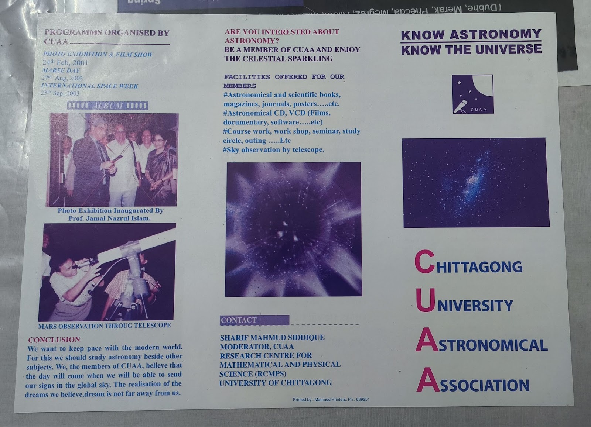

ঘটনা শেষ হইয়াও হইলো না শেষ। অর্ধেক রাস্তা যাবার পর ট্রেন আর আগায় না। কিছু সময় পর সবাই বুঝতে পারলাম, আমাদের ট্রেন আর আগাবে নাহ, ইঞ্জিন নষ্ট! সবাই ক্লান্ত শরীরে কিছু সময় পর চিন্তা করল, এভাবে আর বসে না থাকি। ট্রেন থেকে সব ব্যাগ বহর নামিয়ে রেল লাইন ধরে চলতে থাকলাম নিকটবর্তী রাস্তার দিকে। আশপাশ সবুজময়, দূরে পাহাড়, আশেপাশে নেই তেমন কোনো বাড়ি ঘর। অনেকটা পথ অতিক্রমের পর এক রাস্তার সন্ধান পেয়েই গেলাম। ভাগ্য সহায় ছিল তখন, সিএনজিতে করে আবারও আমাদের যাত্রা শুরু হলো চবির পানে।

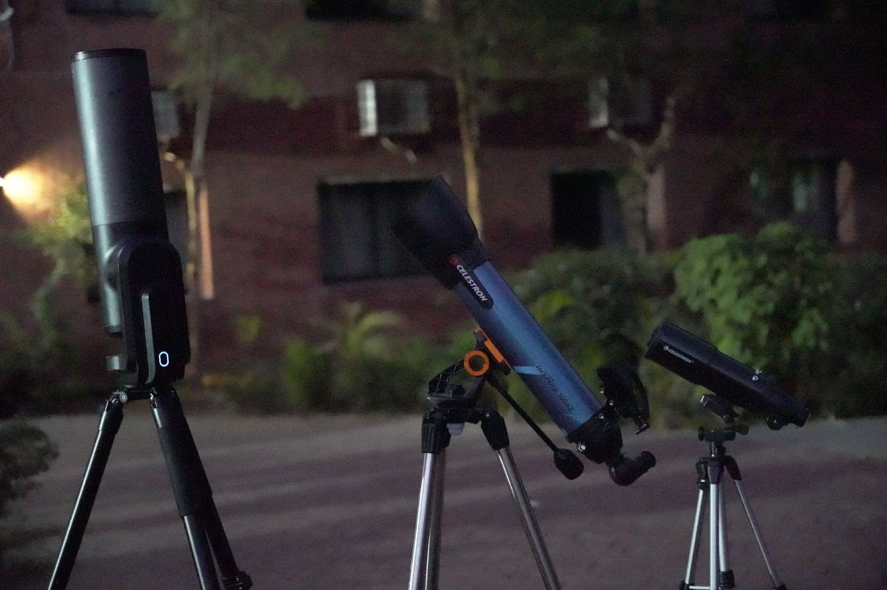

চট্টগ্রাম বিশ্ববিদ্যালয়ের উঁচুনিচু আঁকাবাঁকা পথ ধরে চলতে থাকলাম আমরা। বহুদূর যাত্রার পর আমরা পৌঁছাই চট্টগ্রাম বিশ্ববিদ্যালয়ের অন্যতম সুন্দর সড়ক বোটানিকেল গার্ডেন রোডে। ঠিক এর এক পাশেই রয়েছে আমাদের গন্তব্য। সেটা হলো বিশ্বনন্দিত ও বাংলাদেশের অন্যতম পরিচিত বিজ্ঞানী জামাল নজরুল ইসলামের হাতে তৈরি করা জামাল নজরুল ইসলাম রিসার্চ সেন্টার।  দ্বিতল বিশিষ্ট এই সেন্টারে জামাল নজরুল ইসলাম দীর্ঘকাল পরিচালক হিসেবে যুক্ত ছিলেন। আমরা পৌঁছানোর পর সকল ব্যাগপত্র রেখে দেখা করি সেখানের জনাব শরীফ মাহমুদ সিদ্দিকীর সাথে। জোর্তিবিজ্ঞানের বিভিন্ন আলোচনায় জামাল নজরুল ইসলামকে স্মরণ করা হয়। এই সেন্টারের ছোটো একটা বদ্ধ রুমে রয়েছে জামাল নজরুল ইসলাম স্যারের একটা ছোট্ট মিউজিয়াম। যেখানে রয়েছে তার ব্যবহৃত বিভিন্ন সামগ্রী, যেমন প্রজেক্টর, বোর্ডে শেষ কিছু লেখা, চেয়ার, টেবিল সহ অনেক কিছু। সাথে রয়েছে তার হাতে লেখা কনফারেন্স পেপারের বই, যেখানে নোবেল লরিয়েট আব্দুস সালাম, প্রফেসর রজার পেনরোজ সহ অনেক বড় বিজ্ঞানীদের নিদর্শন রয়েছে। এছাড়াও স্যারের হাতের বিভিন্ন লেখনি, সামগ্রী এবং বিভিন্ন ছবিতে ভরপুর ছিল পুরো রুম।

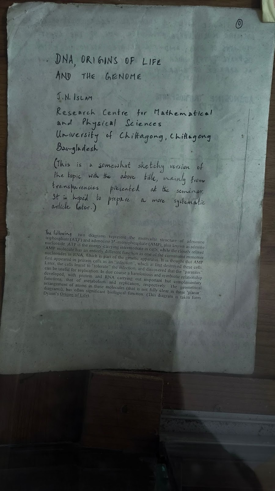

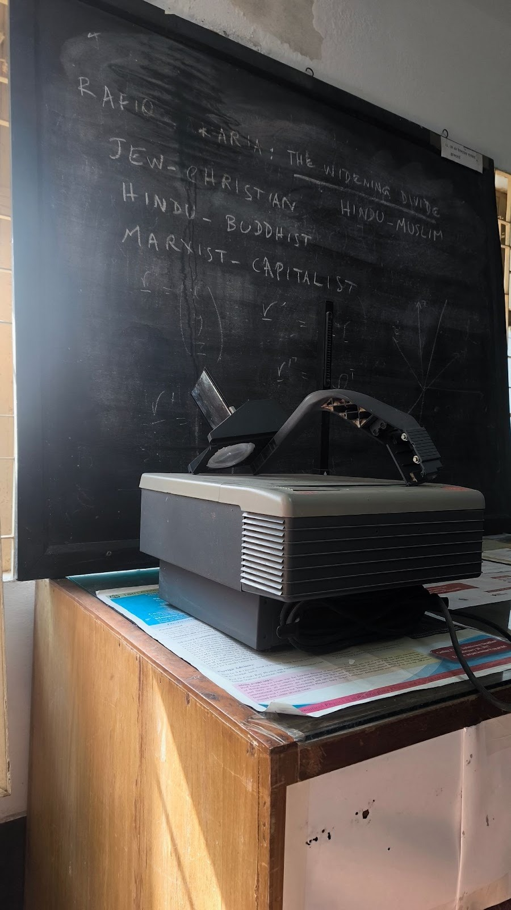

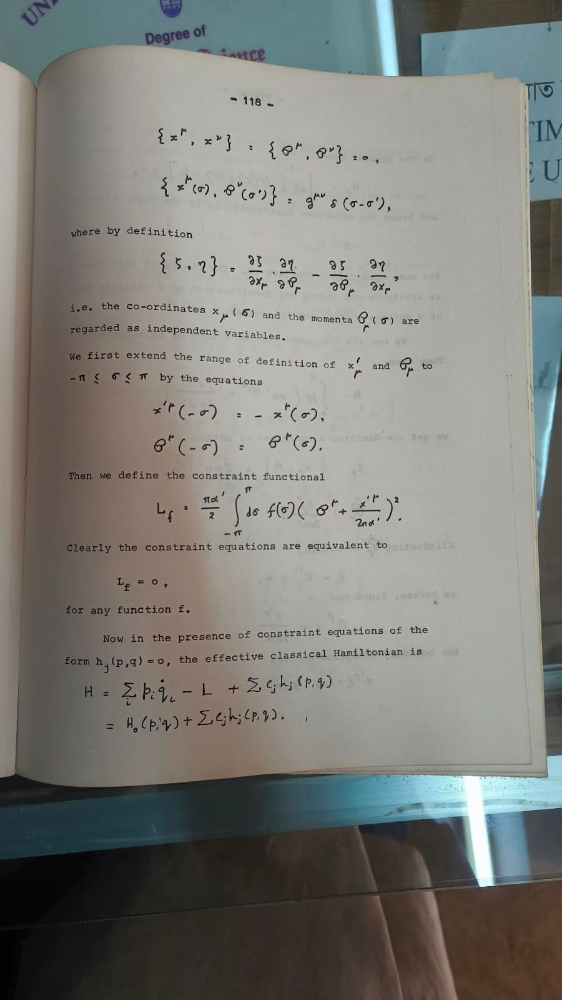

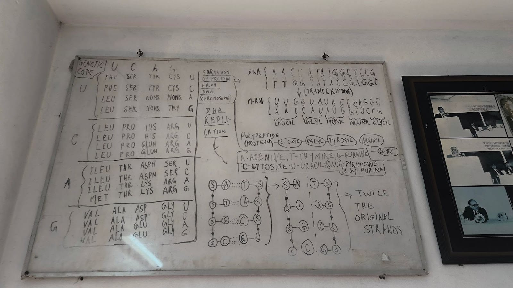

এরপর নানা সংশোধনের পর আমরা জামাল নজরুল ইসলাম সেন্টারের টেলিস্কোপের অনুমতিপত্র পেলাম। এরপর সজীব ভাই চলে গেল ফিজিক্স ডিপার্টমেন্টের টেলিস্কোপ আনতে। এদিকে সিউআরএইচএস-এর ভলেন্টিয়াররা সবার জন্য গিফট তৈরিতে প্রস্ততি গ্রহণ শুরু করলো। আর আমরা কুইজের প্রশ্নগুলো এবং সেশন প্রস্ততিমূলক কাজগুলো সম্পন্ন করতে থাকি। এরপর বিশ্রাম এবং দুপুরের খাবার শেষে আমরা প্রস্ততি নেই আমাদের ভেনুতে যাবার। আবারও উঁচুনিচু পাহাড়ের মাঝ দিয়ে বহুদূর যাবার পর চট্টগ্রাম বিশ্ববিদ্যালয়ের অপর প্রান্তে আমরা পৌঁছে যাই, যেখানে আমাদের ভেনু, চবির ল ফ্যাকাল্টিতে। সেখানের অডিটরিয়ামেই শুরু হবে আজকের এস্ট্রোনমি নাইট এন্ড টক ২.০।

### সজীব

ভোর ৪টা ৪০। কয়েক দফা অ্যালার্মের পর ঘুম ভাঙল। শহর তখনও নিঃশব্দ, যেন শীতশীত এই ভোরে ঘুমকাতুরে আমি আরেকটু ঘুম দিতে চেয়েও নিজেকে আটকালাম। আমি রওনককে ফোন করে বললাম, আমি পৌঁছানো পর্যন্ত যেন তারা স্টেশনে অপেক্ষা করে। সে জানাল, তারা নাকি কাছাকাছিই আছে। আসলে তার কথা ছিল ভোর ৪টার দিকে আমাকে কল করবে, কিন্তু ঘুম তাকে আগেই হার মানিয়েছিল। ভাগ্য ভালো, ট্রেনের মাস্টার শেষদিকে ইচ্ছা করে গতির লাগাম টানায় একটু দেরিতে পৌঁছায়, ফলে আমার দেরি হওয়ায় তাদেরকে আমার জন্য বেশিক্ষণ অপেক্ষা করা লাগেনি।

ফ্রেশ হয়ে ফজরের নামাজ পড়ে ঘর থেকে বের হলাম। প্রস্তুতি বলতে তেমন কিছুই ছিল না। আগের রাতেই ব্যাগ গোছানো, এমনকি পরের দিনের জন্য ঠিক করা পোশাক পরেই ঘুমানো। তাই তাড়াহুড়ো নেই। তখনও অন্ধকার, পাবলিক বাসের আশা নেই। তবে ভাগ্য সহায় হলো। কয়েক মিনিটের মধ্যেই একটি রাইডার বাস পেয়ে গেলাম। বাস ফাঁকা, গতিও ভালো। পনেরো-বিশ মিনিটেই পৌঁছে গেলাম স্টেশনে।

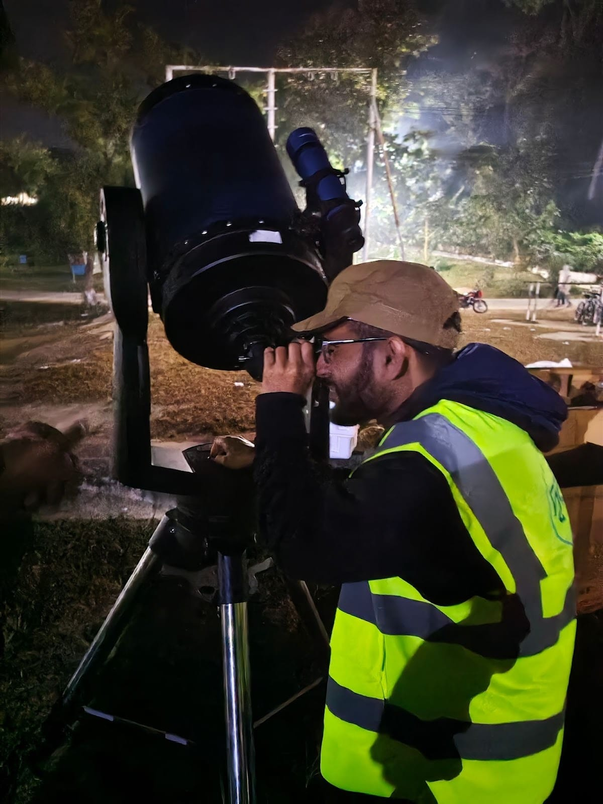

স্টেশনে রওনক, নাফিস আর নক-বিডি'র (আইএইউ ন্যাশনাল আউটরিচ কোঅর্ডিনেটর - বাংলাদেশ) খাদিজা অপেক্ষা করছিল। কুশল বিনিময়ের পর আমি তাদের পুরনো রেলস্টেশনের দিকে নিয়ে গেলাম, যেটাকে আমরা মজা করে নিজেদের ‘কিংস ক্রস’ স্টেশন বলি। প্ল্যান ছিল সেখান থেকে চবি শাটল ধরা। ভারী টেলিস্কোপের ব্যাগ নিয়ে প্ল্যাটফর্মে এসে দেখি পাশাপাশি দুটো শাটল দাঁড়িয়ে। কোনটা আমাদেরটা, সেটা বোঝার অপেক্ষায় রইলাম। যখন ছাত্ররা সঠিক ট্রেনে উঠতে শুরু করল, তখন আমরাও উঠে পড়লাম।

যাত্রা শুরু হলো বেশ স্বাভাবিকভাবেই। সব ঠিকঠাক চলছিল, যতক্ষণ না নাফিস ঘুমিয়ে পড়ল। তখনই যেন কপালের লিখন বদলে গেল। নাফিসের সঙ্গে সঙ্গে ট্রেনটাও ঘুমিয়ে পড়ল। লোকোমাস্টার প্রাণপণ চেষ্টা করলেন ট্রেনটাকে জাগাতে, কিন্তু ট্রেন অনড়। ভেতরে বসে নানা রকম হিসাবনিকাশ আর গল্পের পর সিদ্ধান্ত হলো, এই ঘুমন্ত ট্রেনে বসে থাকা যাবে না। নাফিসকে জাগালাম।

চৌধুরীহাটের একটু পর কোথাও আমরা নেমে পড়লাম। সামনে রেললাইন, পাথুরে পথ, আর সবচেয়ে রোমাঞ্চকর অংশ, একটি খাল, যার ওপর কোনো ব্রিজ নেই, সরাসরি ট্রেন ট্র্যাক। রেললাইনের ধারে ধারে হাঁটা, খাল পার হওয়া, পুরো ব্যাপারটা যেন সাবওয়ে সার্ফারের লাইভ ভার্সন। খাল পার হওয়ার সময় নাফিসের হাইট ফোবিয়া দেখাটা আলাদা বিনোদনই ছিল। শেষমেশ একটি রাস্তায় পৌঁছে একটি সিএনজি পেলাম। আর বিশ মিনিটের মধ্যেই আমরা পৌঁছে গেলাম জেএনআই (জামাল নজরুল ইসলাম) আরসিএমপিএস (রিসার্চ সেন্টার ফর ম্যাথেমেটিকেল এন্ড ফিজিকেল সায়েন্সেস), সেখানেই সিইউআরএইচএস অফিস।

সেখানে আমাদের উষ্ণ অভ্যর্থনা জানানো হলো। টেলিস্কোপগুলো সেট করে ইউনিস্টেলার চার্জে বসিয়ে আমরা খাদ্যের অন্বেষণে চবি লেডিস ঝুপড়ির দিকে গেলাম। চা নাস্তা, প্ল্যানিং, গল্প। তারপর আবার ফিরে এলাম আরসিএমপিএস-এ। তখন সিইউআরএইচএস-এর ভলান্টিয়াররা অংশগ্রহণকারীদের জন্য গুডিজ গুছিয়ে নিচ্ছিল।

এরপর দেখা হলো রিসার্চ সেন্টারের শরীফ মাহমুদ সিদ্দিকীর সঙ্গে, তিনি এস্ট্রোনমি নিয়ে বেশ কিছু বইও লিখেছেন, লিখেছেন বিজ্ঞানীদের জীবনীও। তিনি আমাদের শুধু স্বাগতই জানাননি, আমাদের নিয়ে গেলেন সময়ের ভেতর দিয়ে হাঁটতে হাঁটতে। সিইউএএ-এর মতো কমিউনিটি চালানোর গল্প, প্রফেসর জেএনআই'র কথা- এক মায়েস্ত্রো'র জীবন। তিনি আমাদের সেন্টারের ভেতরের ছোট একটি মিউজিয়ামে নিয়ে গেলেন। সেখানে জেএনআই-এর স্মৃতিগুলো এখনো জীবন্ত। লেখা বোর্ড, ব্যবহৃত জিনিস, অ্যানালগ প্রজেক্টর, ছবি, এমনকি হাতে লেখা কনফারেন্স প্রসিডিংস, যেখানে একসময় প্রফেসর রজার পেনরোজ, প্রফেসর আবদুস সালামের মতো মানুষরা অংশ নিয়েছিলেন। নাফিস মন দিয়ে ছবি তুলল। আমরা আলোচনা করলাম, কীভাবে এই স্মৃতিগুলো দীর্ঘদিন ধরে বাঁচিয়ে রাখা যায়।

এরপর শুরু হলো দৌড়ঝাঁপ। টেলিস্কোপ ব্যবহারের জন্য আরসিএমপিএস আর সিইউ ফিজিক্স ডিপার্টমেন্টের ফরমালিটি শেষ করতে হবে। নাফিস, রওনক আর আমি ব্যস্ত হয়ে পড়লাম কুইজ বানাতে। নিচতলায় একটা অফিসে জায়গা হলেও ইলেকট্রিক কানেকশনের ঝামেলায় কিছুটা বিরক্ত হয়ে আমরা উপরের তলার একটি ছোট চেম্বারে আশ্রয় নিলাম। একটা টেবিল, কয়েকটা চেয়ার, কিন্তু বেশ শান্ত- এইতো চাইইইইই।

এই শান্তিটা বেশিক্ষণ থাকেনি। আমার যেতে হল সায়েন্স ফ্যাকাল্টিতে, টেলিস্কোপ আর একটা অনুমতি (ফরমালিটি) আনতে। সেখানে এক অন্য কাহিনী হল। ফিজিক্সের টেলিস্কোপ যখন স্টোর রুম থেকে বের করছি, তখন স্টোরের ইনচার্জ বললেন ব্যাটারি রিকশাগুলো র‍্যাম্প দিয়ে চারতলায় চলে আসে। সেটা শুনে টেলিস্কোপের ছেঁড়া বাক্স বহনের ঝামেলা কমাতে আমরা রিকশা নিয়ে চারতলা পর্যন্ত উঠে গেলাম। তবে ঝামেলা হল যখন সায়েন্স ফ্যাকাল্টির চারতলায় এক ফ্যাকাল্টি মেম্বার আমাদের রিকশা আটকে দিলেন। শেষ পর্যন্ত রিকশা ফেরত পাঠাতে হলো। দুইজন অর্গানাইজার মিলে টেলিস্কোপ সামলালেন।

ফিজিক্স থেকে ফেরার পথে এক ক্যাম্পেইন কার্টের "ফ্রি! ফ্রি!" নুডলস পেয়ে সেটা হাতে আরসিএমপিএস ফিরে ঐ চেম্বারেই দুপুরের খাবার হলো। এরপর শুরু হলো প্যাকিং। বড় আট ইঞ্চি টেলিস্কোপ একটা পুরোনো এসি'র এক্সস্ট কার্টনে ঢোকানো হলো, যাতে করে বহুদিনের ছেঁড়া বাক্সে থাকা ‘গোটু কোগাকু’ টেলিস্কোপকে নিরাপদে বহন করা যায়। সবশেষে সবকিছু পৌঁছে গেল ল’ ফ্যাকাল্টি অডিটোরিয়ামে। টেলিস্কোপের সারিতে দূরবিন টেলিস্কোপগুলো ছিল সবচেয়ে সহজে বহনযোগ্য। নক-বিডি-এর নতুন অ্যাস্ট্রোমাস্টার ১৩০ইকিউ অবশ্য বাক্সের ঝামেলায় পড়েছিল, যেমনটা দীর্ঘদিন ধরে আমাদের সেলেস্ট্রন ইনস্পায়ার ১০০এজেড ভোগ করে এসেছে। (মজার ব্যাপার হলো, একটি গানের দোকান থেকে আলাদা করে ব্যাগ বানিয়ে নেওয়ার পরে সেলেস্ট্রন ১০০ এজেড টেলিস্কোপই এখন বহন করা আমাদের জন্য সবথেকে সহজ হয়ে গিয়েছে!)

অডিটোরিয়ামে ঢুকতেই শুরু হলো ইনডোর সেশন। আমাকে স্টেজে ডেকে দূরবিন নিয়ে বলতে বলা হলো। ঠিক তখনই মাইক্রোফোন বিকল। প্রযুক্তির সঙ্গে চিরচেনা লড়াই। দুইবার চেষ্টা করে হাল ছেড়ে দিয়ে নিজের গলার জোরেই কথা বললাম।

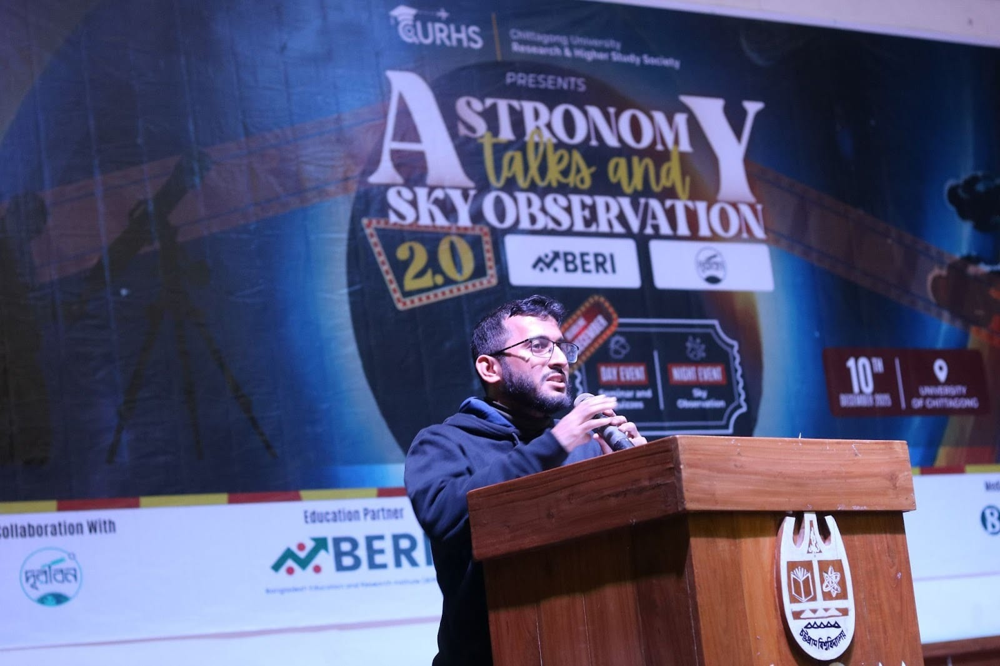

প্রফেসর উজ্জ্বলের কসমিক হিস্ট্রি নিয়ে কি-নোট আর প্রফেসর অঞ্জনের বক্তব্য দারুণভাবে চলল। প্রশ্নোত্তর পর্বে বোঝা গেল, অংশগ্রহণকারীরা সত্যিই জানতে চায়। প্রায় এক ঘণ্টা ধরে প্রশ্ন আর উত্তর চলল। এরপর শরীফ স্যার শীতের আকাশ নিয়ে একটি ইনসাইট সেশন নিলেন।

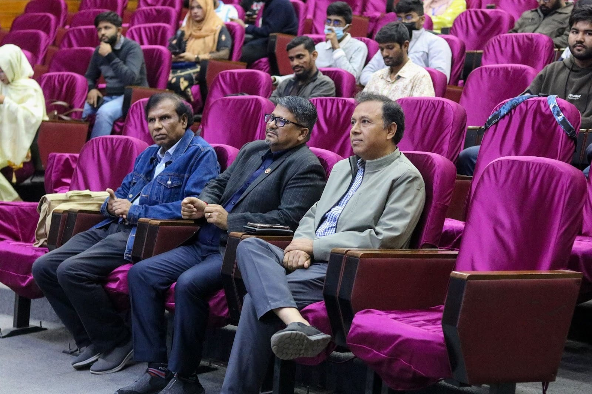

তারপর কিছু টেলিস্কোপ মাঠে সেটআপের জন্য পাঠিয়ে দিয়ে আমরা স্টেজে উঠে জ্যোতির্বিজ্ঞানের উপর ওয়েগ্রাউন্ড কুইজ শুরু করলাম। কুইজ শেষে এত অল্প সময়ে সেটআপ কীভাবে হবে, সেটা নিয়ে একটু দুশ্চিন্তা ছিল। কিন্তু সিইউ ফিজিক্সের মাহথির আবারও ভরসা হয়ে দাঁড়াল। তার চতুর্থ বর্ষের ফাইনাল চললেও, ইকুয়েটোরিয়াল টেলিস্কোপ মাউন্ট করার সময় তাকে পেলাম সবচেয়ে আগ্রহী মানুষ হিসেবে।

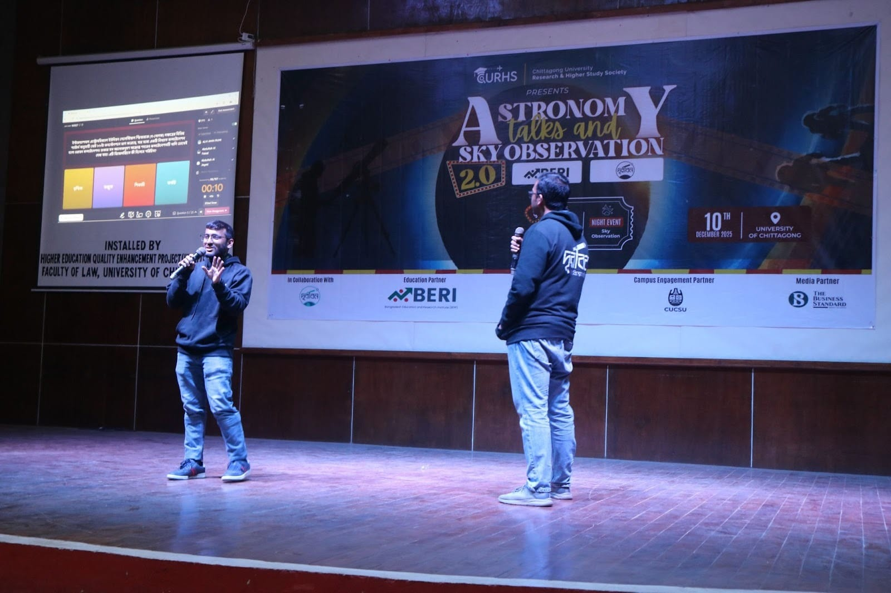

কুইজ নিয়েও ছিল আরেক টেনশন। ওয়েগ্রাউন্ড ফ্রিতে ১০০ জন পর্যন্ত সাপোর্ট দেয়। আমরা ভাবছিলাম, ১০০ জনের বেশি হয়তো আগ্রহী হবে না। কিন্তু কোড দেখানোর পর সংখ্যাটা হু হু করে বাড়তে লাগল। একসময় ১২০ ছাড়াল।

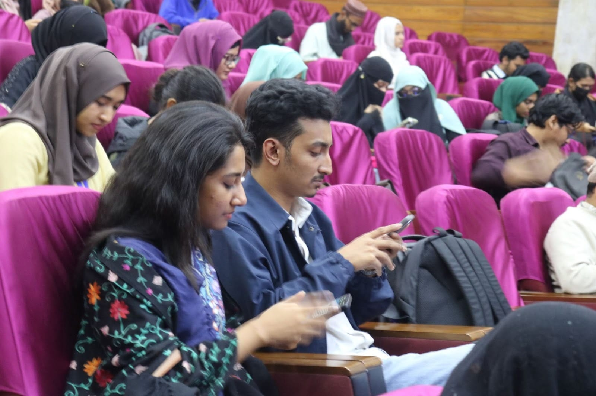

অবাক করা ব্যাপার, তবুও কুইজটা ফ্রিতেই চলল। কয়েকটা প্রশ্নের পর আমি স্টেজ নাফিসের হাতে তুলে দিলাম। সে প্রতিটি প্রশ্নের পর ইতিহাস আর সায়েন্স মিলিয়ে ব্যাখ্যা দিচ্ছিল। কুইজটা তখন আর শুধু খেলা রইল না, হয়ে উঠল শেখার এক আনন্দময় পথ।

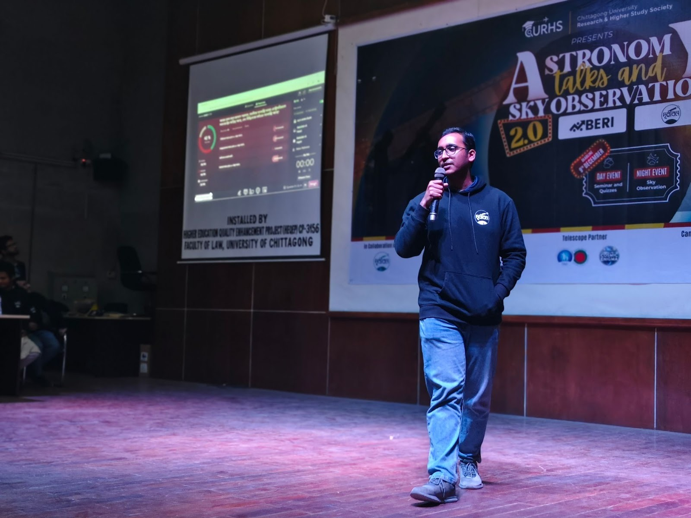

শেষে ১০ জন অংশগ্রহণকারী পুরস্কার পেল। প্লাক, প্ল্যানেট-থিমড ফ্রিজ ম্যাগনেট, মুন ম্যাপ। আর আমরা সবাই বুঝলাম, সারাদিনের দৌড়ঝাঁপ, ঘুমহীনতা, ঝামেলা সবই সার্থক হয়েছে। আকাশের গল্পটা সেদিন আরও কয়েকটা মানুষের মনে জায়গা করে নিয়েছে।

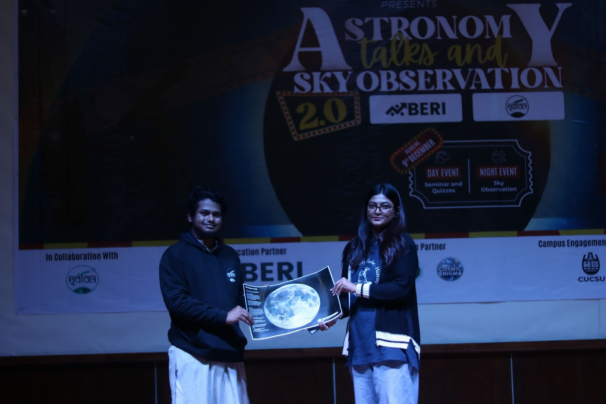

### ২য় দিন

‘অ্যাস্ট্রোস্কুল বাংলাদেশ’ আইএইউ-এর নক-বিডি অফিসের একটি আউটরিচ উদ্যোগ। লক্ষ্য খুব স্পষ্ট। ক্লাসরুমকে আকাশের সাথে যুক্ত করা। হাতে থাকা (অ্যাস্ট্রোএডু / ইউএনএডব্লিউই / স্পেসস্কুপ) রিসোর্স এবং স্থানীয় প্রতিষ্ঠান বা এলাকার সুযোগ-সুবিধা ব্যবহার করে এমন একটি অভিজ্ঞতা তৈরি করা, যা হবে রিপিটেবল, ফ্রিকোয়েন্ট, লো-কস্ট, টাইম-ইনডিপেন্ডেন্ট, কোয়ালিটিফুল এবং সর্বোপরি ইনস্পায়ারিং। শুরু থেকেই গুরুত্ব দেওয়া হয়েছে সাসটেইনেবল এবং রিইউজেবল রিসোর্স ব্যবহারের ওপর।

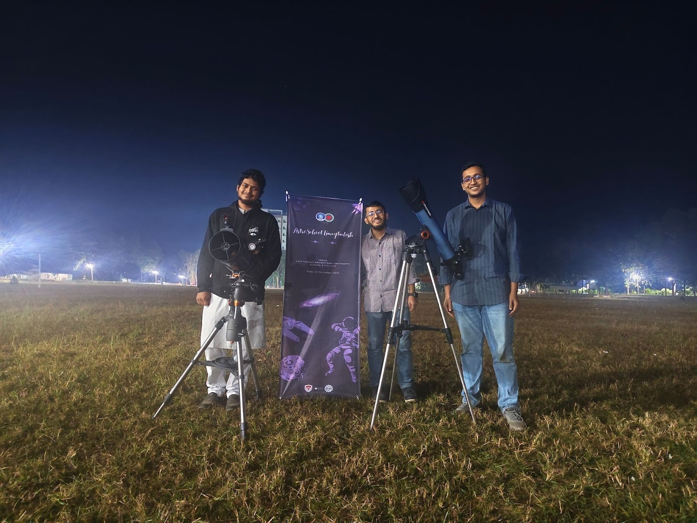

এই গল্পের শুরু স্কুলের প্রথম অ্যাস্ট্রোস্কুল বিডি দিয়ে। কোনো পাবলিক বা ন্যাশনাল হলিডে নয়। নিয়মিত ক্লাস আওয়ারের মাঝখান থেকে সময় নেওয়া হয়েছিল, মাত্র অর্ধেক সময়। দেয়ালে ছিল একটি রিইউজেবল ব্যানার। আয়োজন এবং সেশন পরিচালনা সবই করেছেন লোকাল ভলান্টিয়াররা। প্রিন্টের ব্যবহার ছিল একেবারেই ন্যূনতম। টেলিস্কোপ প্রস্তুতির সময় এবং আকাশ একটু ডার্ক হওয়ার অপেক্ষায় খোলা মাঠে চলেছে আউটডোর স্টেলারিয়াম গাইড সেশন। অপেক্ষমাণ গ্রুপগুলো বসে থাকেনি। দলভিত্তিক কুইজ-বেইজড লার্নিং তাদের পুরো সময় জুড়ে ব্যস্ত রেখেছিল। রাত আটটার মধ্যেই অবজারভেশন পর্ব গুছিয়ে ফেলা হয়।

১১ ডিসেম্বর ২০২৫ তারিখে গল্পে যোগ দেয় দূরবিন ভলান্টিয়ার্স, সাথে দূরবিন টেলিস্কোপস। টেলিস্কোপগুলো তখন চট্টগ্রামেই ছিল। সূর্য ডোবার পর শুরু হয় পোস্ট-সানসেট স্টেলারিয়াম গাইড। এক পাশে গ্রুপে গ্রুপে আউটডোর কুইজ, আর প্ল্যানেট না থাকলে শেখার জন্য চালু হয় ব্রিংঙিং আ স্টার টু দ্য গ্রাউন্ড অ্যাক্টিভিটি।

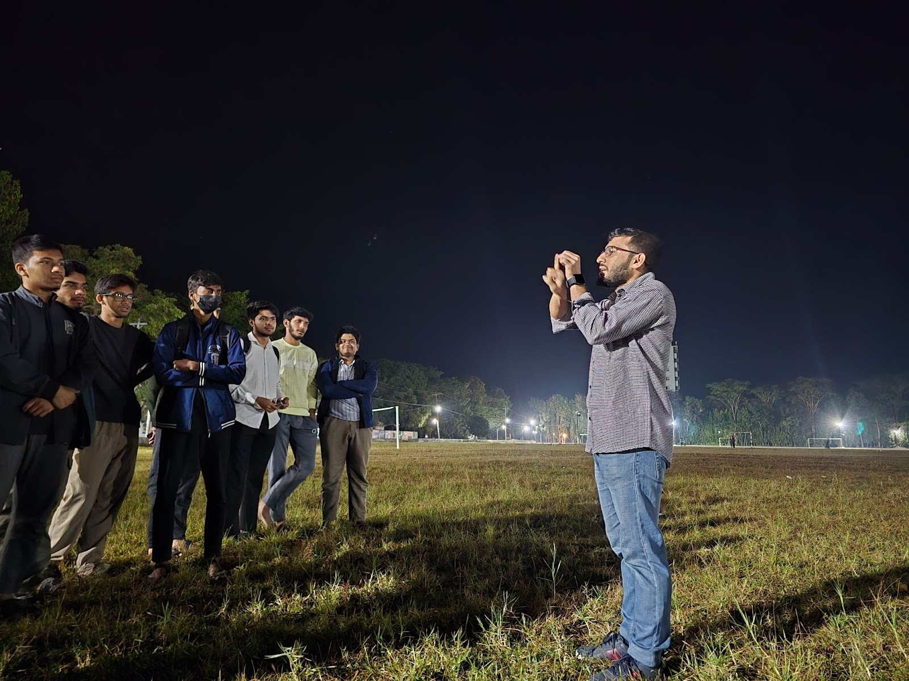

ইউনিস্টেলার টেলিস্কোপ দিয়ে বেছে নেওয়া হয় কয়েকটি ডিপ স্কাই অবজেক্ট। পরপর দুইটি গ্রুপের জন্য আলাদা আলাদা অবজেক্টে টার্গেট করা হয়। প্রথমে দেখানো হয় নন-এনহ্যান্সড ভিউ। এরপর স্টেলারিয়াম মোবাইল থেকে রেফারেন্স ইমেজ দেখে শুরু হয় লং এক্সপোজার। সেই সময়েই বলা হয় অবজেক্টের গল্প, আর কেন ধৈর্য ধরে আলো জমাতে হয়।

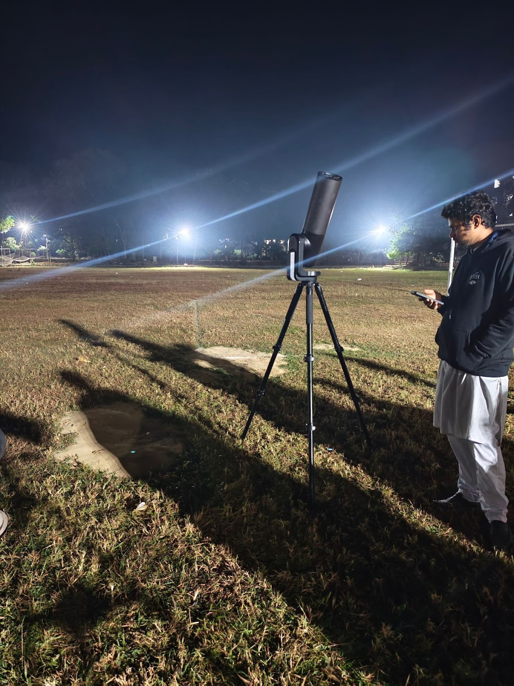

গ্রুপে ভাগ করে নেওয়ায় কথোপকথন সহজ হয়, টেলিস্কোপের অপ্রয়োজনীয় নড়াচড়া কমে আসে। যেহেতু অন্য টেলিস্কোপগুলো প্ল্যানেট অবজারভেশনের জন্য উপযোগী, তাই প্ল্যানেট না থাকলে একটা মজার লার্নিং অ্যাক্টিভিটি চালানো হয়। মাঠের এক প্রান্তে টেলিস্কোপ থেকে প্রায় ৬০ কদম দূরে একজন ভলান্টিয়ার কাগজে একটি  লেখা নিয়ে ফ্ল্যাশ জ্বালিয়ে দাঁড়ান। অংশগ্রহণকারী শিক্ষার্থীরা প্রথমে সেলেসট্রন ইনস্পায়ার ১০০এজেড টেলিস্কোপ ব্যবহার করা শেখে। তারপর তারা একে একে টেলিস্কোপ ব্যবহার করে দূর থেকে সেই লেখা পড়ার চেষ্টা করে।

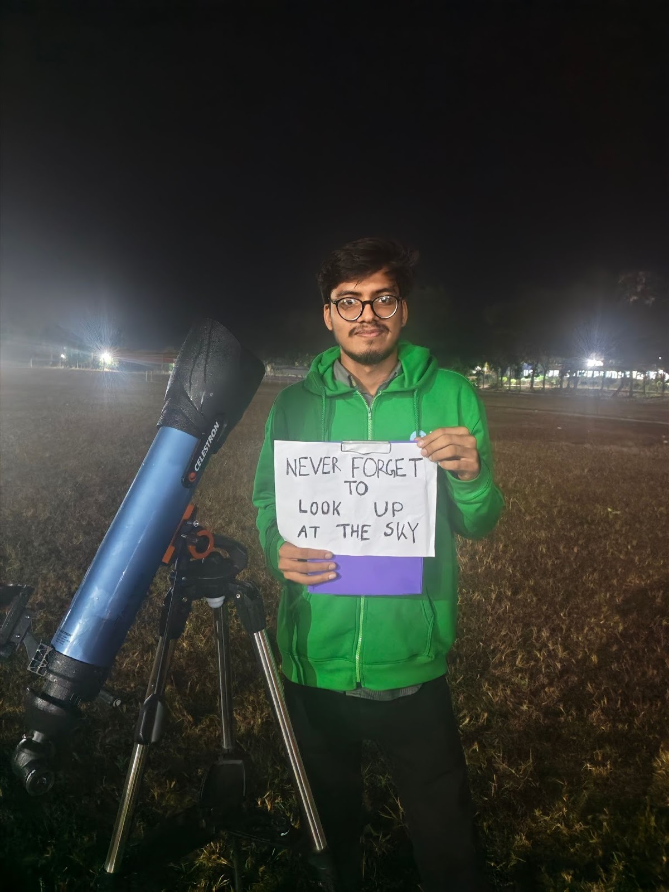

শেষ মুহূর্তে আকাশে দেখা গেল একটি স্টার-লাইক অবজেক্ট, কিন্তু সেটি টিমটিম করছিল না। সব টেলিস্কোপ ঘুরে গেল সেই দিকে। খুব দ্রুত বোঝা গেল এটি একটি প্ল্যানেট, সাথে চারটি ভিজিবল মুন। অংশগ্রহণকারীরাই নিশ্চিত করল এটি জুপিটার, যার কালারফুল স্ট্রাইপস হালকা পরিমাণে দেখা যাচ্ছিল।

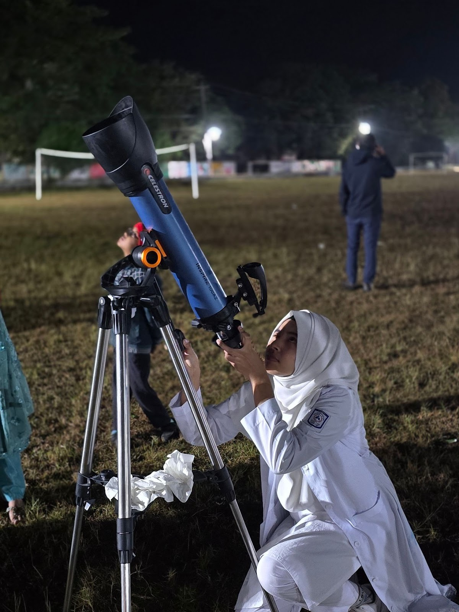

এই ইভেন্টে দূরবিন এনেছিল তিনটি টেলিস্কোপ, ব্যবহার করা হয় দুটি (অশ্বিন-২ আর সেলেস্ট্রন ১০০ এজেড)। অ্যাসরো নিয়ে আসে তাদের নিজেদের এসেম্বল করা অ্যাসরোস্কোপ ডবসোনিয়ান। আর নক-বিডি ব্যবহার করে ইকুয়েটরিয়াল মাউন্টের সেলেসট্রন অ্যাস্ট্রোমাস্টার ১৩০ইকিউ।

এক সন্ধ্যায়, নিয়মিত ক্লাসের ফাঁকে, আকাশ নেমে এসেছিল মাঠে। চোখে দেখা, হাতে ধরা, আর মনে গেঁথে থাকার মতো এক অভিজ্ঞতা।

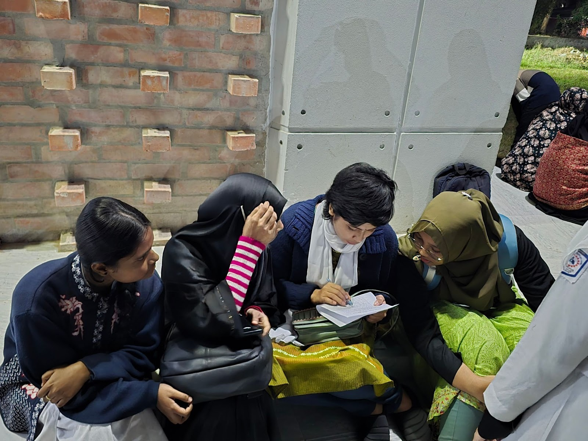

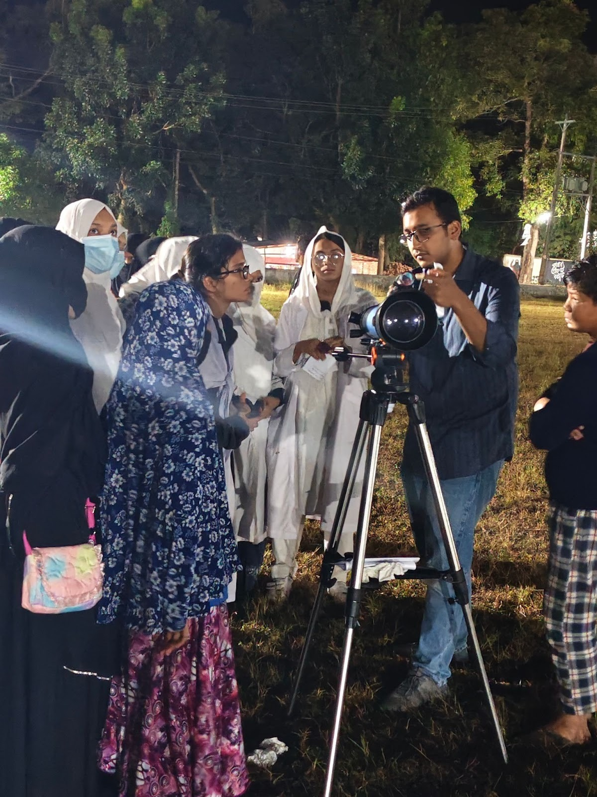

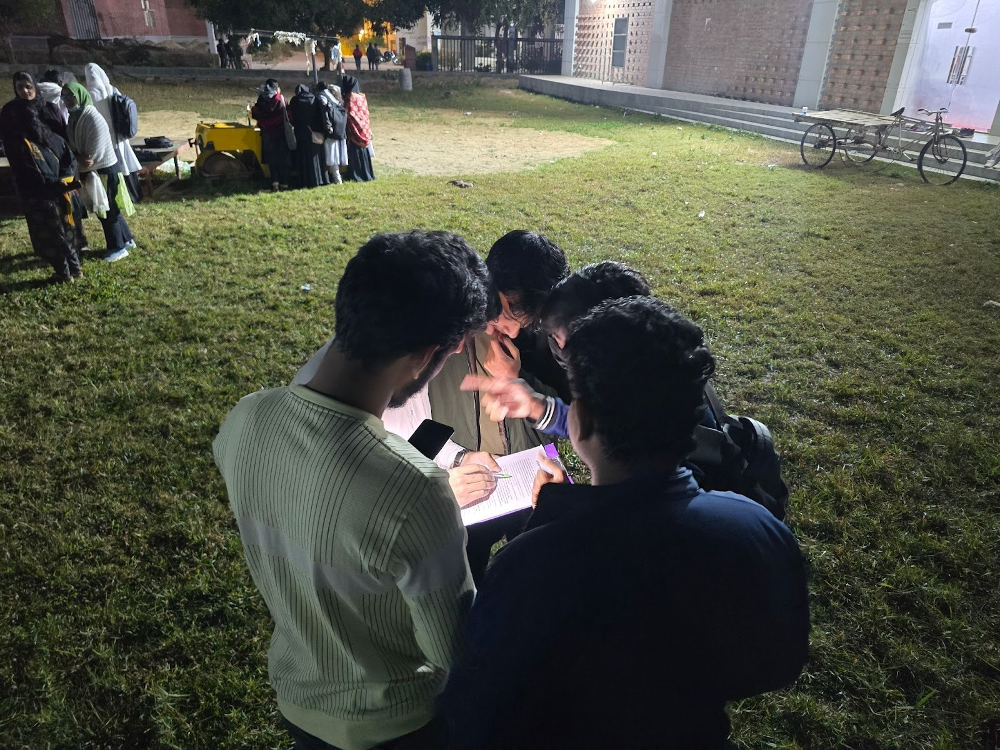

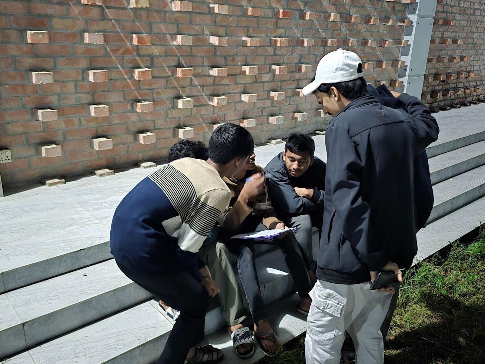

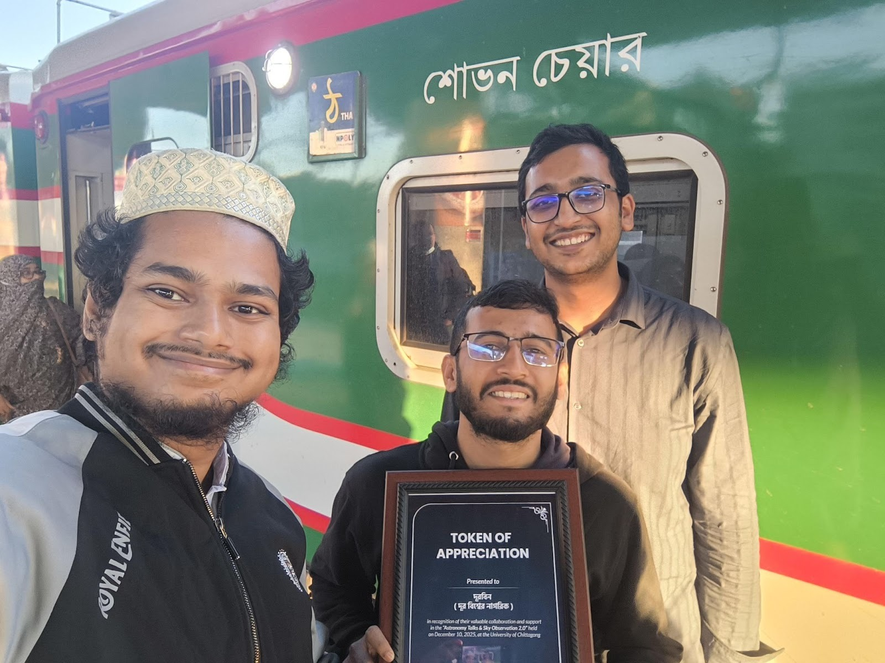
