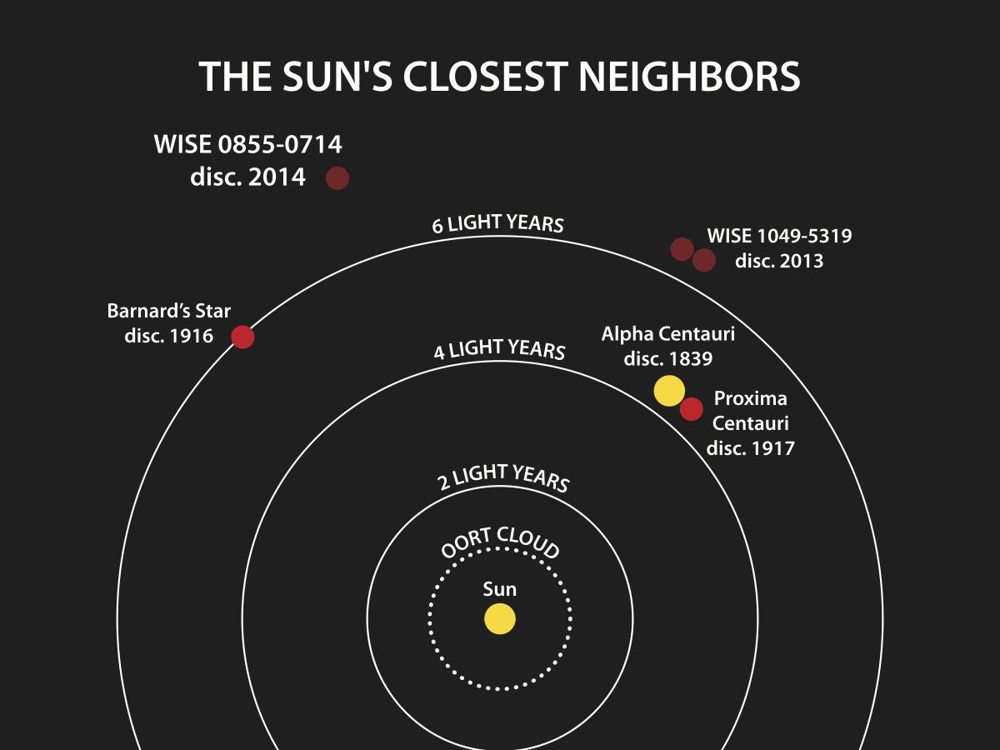

সারাংশ: কয়েক দশকের ব্যর্থ দাবির পর, পৃথিবী থেকে দ্বিতীয় নিকটতম নক্ষত্র ব্যবস্থা (আলফা সেন্টরির পরেই) হিসেবে পরিচিত বার্নার্ডের তারাকে প্রদক্ষিণরত চারটি ছোট গ্রহের অস্তিত্ব অবশেষে নিশ্চিত করা হয়েছে।

**তদন্তের অধীনে নক্ষত্র ব্যবস্থা**

পৃথিবী থেকে মাত্র ৬ আলোকবর্ষ দূরে অবস্থিত বার্নার্ডের তারা অত্যন্ত পরিচিত একটি নক্ষত্র। এটি ১০ বিলিয়ন বছরের পুরনো একটি এম ডোয়ার্ফ তারা, যার ভর সূর্যের ভরের মাত্র ১৬%। গত অর্ধশতাব্দী ধরে এর চারপাশে গ্রহ খুঁজে পাওয়া জ্যোতির্বিজ্ঞানীদের কাছে একটি বড় চ্যালেঞ্জ হয়ে দাঁড়িয়েছিল। ১৯৬০-এর দশক থেকে গবেষকরা সেখানে দূরবর্তী বৃহস্পতি-সদৃশ গ্রহ বা নিকটবর্তী মহাপৃথিবী (সুপার-আর্থ) থাকার দাবি জানালেও প্রতিবারই তা ভুল প্রমাণিত হয়েছে।

এখন মনে হচ্ছে সেই গ্রহ অবশেষে ধরা দিয়েছে। গত নভেম্বরে গবেষকরা বার্নার্ডের তারাকে ৩.১৫৪ দিনে প্রদক্ষিণকারী একটি গ্রহের খবর দিয়েছিলেন। তথ্যে আরও তিনটি গ্রহের উপস্থিতির ইঙ্গিত ছিল, কিন্তু তখন সেগুলো নিশ্চিত করা যায়নি। আজ প্রকাশিত একটি নতুন গবেষণাপত্রে শিকাগো বিশ্ববিদ্যালয়ের ঋত্বিক বসন্ত এবং তাঁর সহযোগীরা বছরের পর বছর ধরে জমানো তথ্য বিশ্লেষণ করে নিশ্চিত করেছেন যে বার্নার্ডের তারায় একটি নয়, বরং চারটি গ্রহ রয়েছে।

সূর্যের সবচেয়ে কাছের স্টার সিস্টেমগুলো দেখানো হয়েছে। বার্নার্ডের তারা সবচেয়ে কাছের একক তারা, প্রক্সিমা সেন্টরি আরো কাছে, তবে তা একটি ট্রিপল স্টার সিস্টেম। অন্য যে দুটি সিস্টেম দেখানো হয়েছে তারা ব্রাউন ডোয়ার্ফ।

**অনুসন্ধানের ধারাবাহিকতা**

গবেষক দলটি ২০২১ থেকে ২০২৩ সাল পর্যন্ত মেরুন-এক্স নামক একটি স্পেক্ট্রোগ্রাফ ব্যবহার করে বার্নার্ডের তারা পর্যবেক্ষণ করেন। বসন্ত এবং তার সহ-লেখকরা মেরুন-এক্সের তথ্যে নক্ষত্রের আলোর বর্ণালির সূক্ষ্ম পরিবর্তন খুঁজছিলেন। গ্রহগুলো যখন নক্ষত্রকে প্রদক্ষিণ করে, তখন তাদের মহাকর্ষীয় টানে নক্ষত্রের রেডিয়াল (আমাদের দৃষ্টিরেখা বরাবর) বেগে যে সামান্য পরিবর্তন ঘটে, তা থেকেই গ্রহের উপস্থিতি বোঝা যায়।

নক্ষত্রের নিজস্ব ঘূর্ণন এবং কার্যকলাপের ফলে আসা সংকেতগুলো সরিয়ে ফেলার পর গবেষকরা স্পষ্টভাবে বার্নার্ড বি এবং বার্নার্ড ডি-এর সংকেত পান। এরপর ধাপে ধাপে গাণিতিক বিশ্লেষণের মাধ্যমে বার্নার্ড সি এবং সবশেষে অতি ক্ষুদ্র সংকেত বিশিষ্ট বার্নার্ড ই-এর অস্তিত্বও নিশ্চিত করা হয়। গত নভেম্বরের তথ্যের সাথে বর্তমান তথ্য মিলিয়ে দেখায় প্রমাণ আরও শক্তিশালী হয়।

**আরও কিছু জানার বাকি**

বসন্তের দল নিশ্চিত করেছেন যে, এই চারটি গ্রহের ভর পৃথিবীর ভরের মাত্র ১৯% থেকে ৩৪% এর মধ্যে। এর মধ্যে বার্নার্ড ই সম্ভবত ‘রেডিয়াল বেগ’ পদ্ধতিতে এ পর্যন্ত আবিষ্কৃত সবথেকে কম ভরের গ্রহ।

এই গ্রহগুলো একে অপরের খুব কাছাকাছি অবস্থিত; তারার চারদিকে তাদের আবর্তনের সময়কাল (মানে তাদের এক বছর) মাত্র ২.৩৪, ৩.১৫, ৪.১২ এবং ৬.৭৪ দিন। এত ঘন সন্নিবিষ্ট একটি ব্যবস্থা কি স্থিতিশীল? একটি মেশিন-লার্নিং অ্যালগরিদম ব্যবহার করে দলটি দেখিয়েছে যে, গ্রহগুলোর কক্ষপথ যদি পুরোপুরি বৃত্তাকার হয়, তবেই এটি দীর্ঘমেয়াদে স্থিতিশীল থাকবে। তবে বর্তমান তথ্যানুযায়ী কক্ষপথ সামান্য বিচ্যুত হলেও পুরো সিস্টেমটি মাত্র ২,০০০ বছরের মধ্যে অস্থিতিশীল হয়ে যেতে পারে। তাই এদের কক্ষপথ এবং দীর্ঘমেয়াদী স্থিতিশীলতা বুঝতে আরও গবেষণার প্রয়োজন।

এখন সেই মিলিয়ন ডলারের প্রশ্ন: এগুলোর কোনোটিতে কি প্রাণের উপযোগী পরিবেশ বা বসবাসযোগ্যতা আছে? দুর্ভাগ্যবশত, নতুন আবিষ্কৃত গ্রহগুলোর একটিও বার্নার্ডের তারার বাসযোগ্য অঞ্চলে অবস্থিত নয়। ওই অঞ্চলে থাকার জন্য কক্ষপথের সময়কাল ১০ থেকে ৪২ দিন হওয়া প্রয়োজন ছিল। বর্তমান তথ্য অনুযায়ী ওই অঞ্চলে পৃথিবীর ভরের অর্ধেক (০.৫৭) বা তার বেশি ভরের কোনো গ্রহ নেই, তবে এর চেয়ে ছোট গ্রহ থাকার সম্ভাবনা এখনো শেষ হয়ে যায়নি।

Translated from ‘Confirmed at Last: Barnard’s Star Hosts Four Tiny Planets,’ AAS Nova, 11 March 2025. Translation by Mahin Istiaz Jahan Tithy in collaboration with AI.
