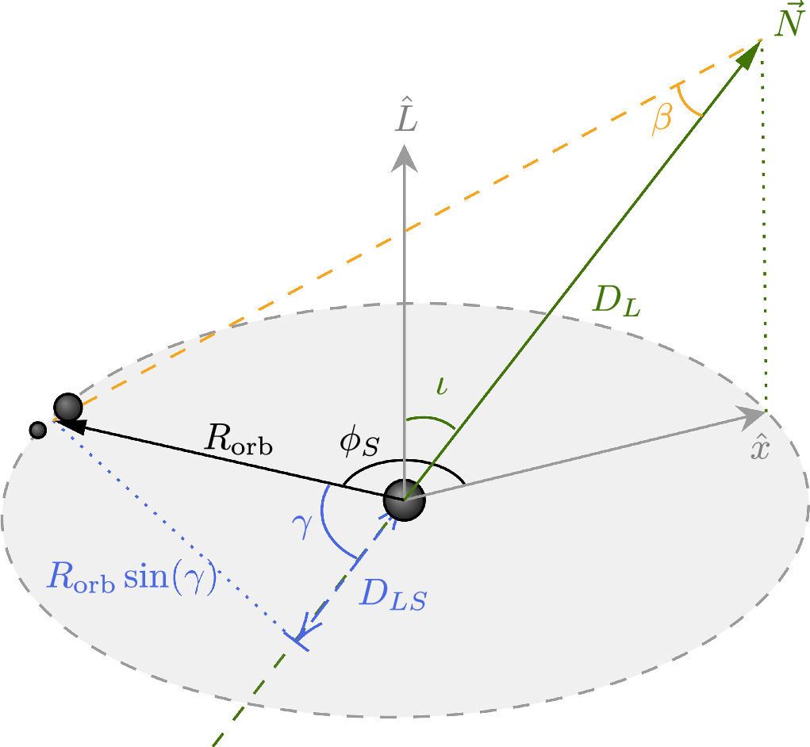

মহাকর্ষীয় তরঙ্গ শনাক্তকারী যন্ত্রগুলো ইতিমধ্যে কয়েক ডজন ব্ল্যাকহোলের একীভূত হওয়ার সংকেত রেকর্ড করেছে। কিন্তু প্রশ্ন হলো — এই মার্জারগুলোর কোনোটি কি গ্যালাক্সির সুপারম্যাসিভ ব্ল্যাকহোলের চারপাশে থাকা ডিস্কের ভিতরে ঘটেছিল?

**ব্ল্যাকহোলের চারপাশে ব্ল্যাকহোল**

'অ্যাক্টিভ গ্যালাক্টিক নিউক্লিয়াস' বা এজিএন হলো মহাবিশ্বের বিভিন্ন গ্যালাক্সির কেন্দ্রে অবস্থিত সুপারম্যাসিভ ব্ল্যাকহোলের চারপাশে গ্যাস ও ধুলার ডিস্ক। এই ডিস্কগুলো তারা এবং স্টেলার-মাস ব্ল্যাকহোলের জন্য একটি চরম ইকোসিস্টেম তৈরি করে। যখন একটি এজিএন ডিস্কের অভ্যন্তরে একজোড়া ব্ল্যাকহোল একত্রিত হয়, তখন এই সংঘর্ষ থেকে সৃষ্ট মহাকর্ষীয় তরঙ্গ পৃথিবীতে শনাক্ত করা সম্ভব। যদি এই ব্ল্যাকহোল মিলনটি আমাদের অবস্থান থেকে সুপারম্যাসিভ ব্ল্যাকহোলের ঠিক পেছনে ঘটে, তবে সেই তরঙ্গটি মহাকর্ষীয় লেন্সিঙের শিকার হবে। এই লেন্সিত মহাকর্ষীয় তরঙ্গ শনাক্ত করা গেলে এজিএন ডিস্কের ভেতরে থাকা ব্ল্যাকহোলের সংখ্যা এবং এসব ডিস্কের বৈশিষ্ট্য সম্পর্কে মূল্যবান তথ্য পাওয়া যাবে।

এজিএন-এর এক্রিশন ডিস্কের কেন্দ্রে একটি সুপারম্যাসিভ ব্ল্যাকহোল, আর প্রান্তে মার্জ করতে পারে এমন এক জোড়া ছোট ব্ল্যাকহোল। N দিয়ে পর্যবেক্ষকের অবস্থান দেখানো হয়েছে।

**লেন্সিং হওয়ার সম্ভাবনা**

এখন পর্যন্ত কোনো লেন্সিত মহাকর্ষতরঙ্গ শনাক্ত করা যায়নি। সৌভাগ্যক্রমে, এই শনাক্ত করতে না পারার বিষয়টিও আমাদেরকে মূল্যবান তথ্য দিয়েছে। শনাক্ত না হওয়ার প্রভাবগুলো খতিয়ে দেখতে স্যামসন লিওং (চাইনিজ ইউনিভার্সিটি অফ হংকং) এবং তার সহযোগীরা একটি গাণিতিক মডেল তৈরি করেছেন যা একটি এজিএন ডিস্কের ভেতরে আবর্তনরত এবং একীভূত হতে থাকা (মার্জিং) এক জোড়া ব্ল্যাকহোল বর্ণনা করে। গবেষক দলটি হিসাব করেছেন এই দুই ব্ল্যাকহোলের এক হওয়ার ফলে উৎপন্ন মহাকর্ষীয় তরঙ্গটি একজন দূরবর্তী পর্যবেক্ষকের দৃষ্টিভঙ্গি থেকে গ্র্যাভিটেশনাল লেন্সিঙের শিকার হওয়ার সম্ভাবনা কতটা। এই সম্ভাবনা নির্ভর করে পর্যবেক্ষকের সাপেক্ষে ডিস্কের ওরিয়েন্টেশন এবং কেন্দ্রের সুপারম্যাসিভ ব্ল্যাকহোল থেকে বাইনারি সিস্টেমের দূরত্বের ওপর।

তারপর তারা এ পর্যন্ত শনাক্ত হওয়া কয়েক ডজন মার্জিঙের ঘটনার কোনোটিতেই লেন্সিং সংকেত না থাকার বিষয়টির উপর ভিত্তি করে এজিএন ডিস্কের ভেতরে কত শতাংশ মিলন ঘটছে তার একটি সীমা নির্ধারণ করেছেন। বর্তমানে মাত্র একশটির মতো বাইনারি ব্ল্যাকহোল মার্জিঙের ঘটনা পর্যবেক্ষণ করা গেছে, তাই শনাক্ত না হওয়ার উপর ভিত্তি করে খুব জোরালো সিদ্ধান্ত নেয়া কঠিন। আপাতত এটুকুই বলা যায় যে, শনাক্ত হওয়া মার্জারগুলোর ৪৭ শতাংশের বেশি এজিএন ডিস্কে ঘটেনি। যখন শনাক্ত হওয়া মার্জিং ঘটনার সংখ্যা বাড়বে, তখন এই সীমা আরও সুনির্দিষ্ট হবে; যদি প্রায় ১,০০০টি মার্জার শনাক্ত হওয়ার পরও কোনো লেন্সিং ইভেন্ট না পাওয়া যায়, তবে তার অর্থ হবে ৫ শতাংশের বেশি মিলন এজিএন ডিস্কের ভেতরে ঘটেনি।

**যে সীমা জানতে হবে**

এই হিসাবটি করা হয়েছে এই অনুমানের ওপর ভিত্তি করে যে, এজিএন ডিস্কের সব ব্ল্যাকহোল কেন্দ্রীয় সুপারম্যাসিভ ব্ল্যাকহোলের সবচেয়ে কাছের ‘মাইগ্রেশন ট্র্যাপে’ গিয়ে একে অপরের সাথে মিশে যায়। ডিস্কের ভেতরে নির্দিষ্ট কিছু কক্ষপথের ব্যাসার্ধে ব্ল্যাকহোলগুলো জমা হবে বলে আশা করা হয়, এবং তেমন বেশ কিছু মাইগ্রেশন ট্র্যাপ থাকার পূর্বাভাস দেওয়া হয়েছে। ব্ল্যাকহোলগুলো যদি এর বদলে অনেক বেশি দূরত্বের ব্যাসার্ধে থাকা কোনো মাইগ্রেশন ট্র্যাপের সাথে মিশে যায়, তবে এক্রিশন ডিস্কের ভেতরে ঠিক কতগুলো মার্জার ঘটছে তা সূক্ষ্মভাবে সুনির্দিষ্ট করতে আরও অনেক বেশি পর্যবেক্ষণের প্রয়োজন হবে।

ভবিষ্যতের পর্যবেক্ষণগুলো এজিএনের এক্রিশন ডিস্ক সম্পর্কে নতুন তথ্য দিতে পারে। বিশেষ করে, একটি এক্রিশন ডিস্কের সর্বনিম্ন আকার কত হতে পারে এবং ডিস্কের ঠিক কোথায় বাইনারি ব্ল্যাকহোলগুলোর একীভূত হওয়ার সম্ভাবনা সবচেয়ে বেশি, তা শনাক্ত করা সম্ভব হতে পারে।

*Translated from '[Gravitationally Lensed Gravitational Waves from Black Holes Around Black Holes](https://aasnova.org/2025/03/19/gravitationally-lensed-gravitational-waves-from-black-holes-around-black-holes/),' AAS Nova, 19 March 2025. Translation by Sornali Akter Tayeba in collaboration with AI.*
