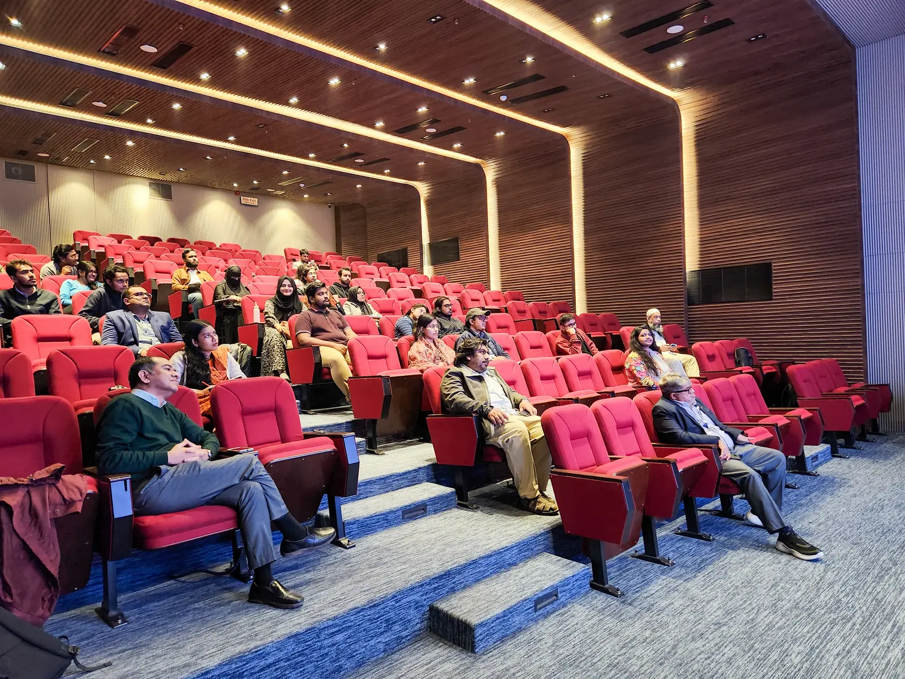
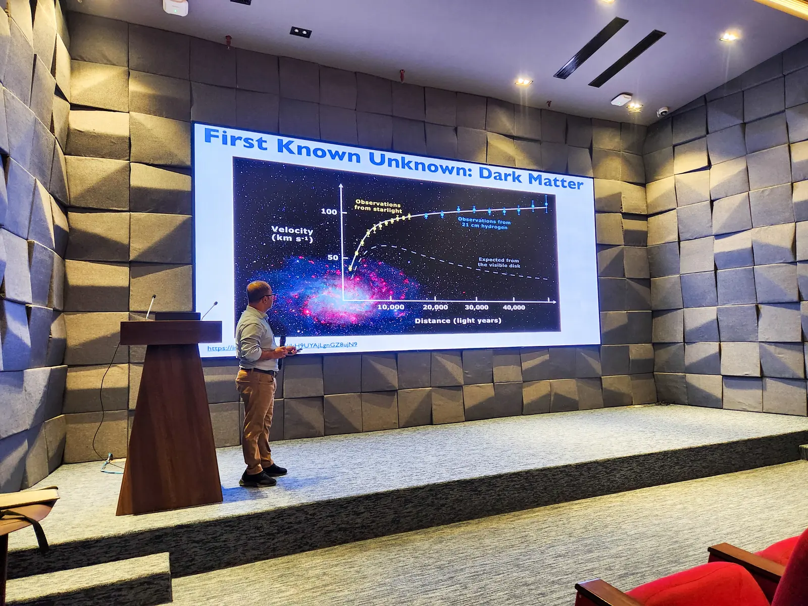
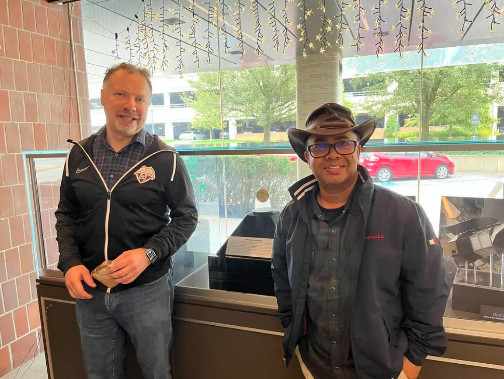
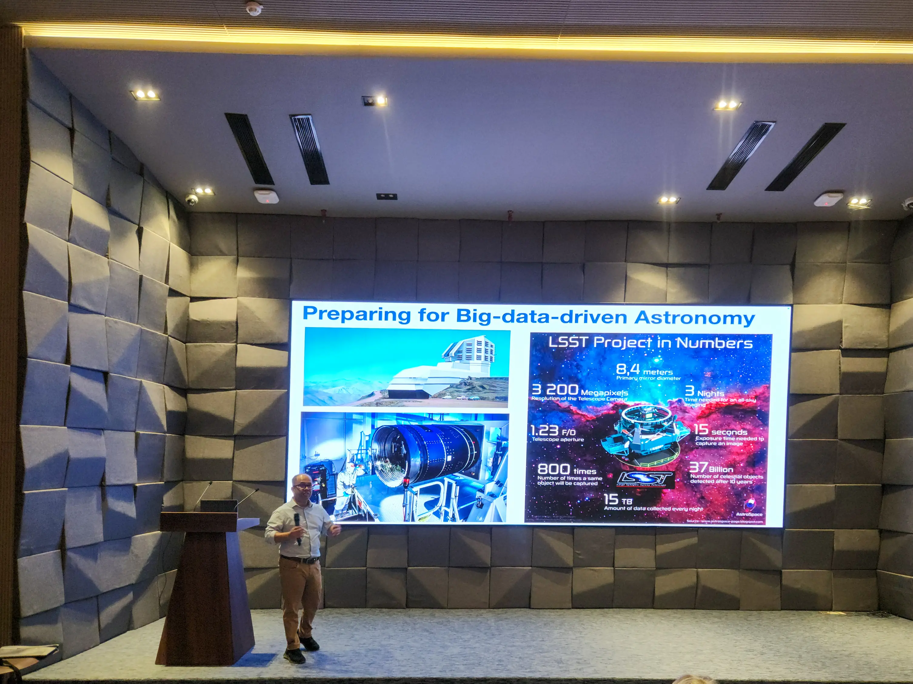

On January 5th, Syed Ashraf Uddin, a faculty, astronomer and astrophysicist from the University of South Carolina, USA, delivered a lecture at the third colloquium of the Center for Astronomy, Space Science, and Astrophysics (CASA), which is under construction at the Independent University, Bangladesh (IUB). The colloquium took place in the state-of-the-art lecture gallery of the newly built "DMK Building," named after IUB's founding president and former education minister, A. Majid Khan.

Ashraf Uddin was hosted at IUB by the Director of Graduate Studies and Research Office, M. Arshad Momen, the Head of the Department of Electrical and Electronics Engineering, Mustafa Habib Chowdhury, Professor Amin Ahsan Ali from the Department of Computer Science, and Assistant Professor Jewel Kumar Ghosh from the Department of Physical Sciences. Approximately thirty undergraduate students from IUB and other universities in Dhaka attended the colloquium, either in person or online.

The main topic of Ashraf Uddin's discussion was the determination of the Hubble constant, or the rate of expansion of the universe, through the observation of Type 1a supernovae. For the convenience of students, he divided the talk into two parts. In the first part, he discussed the fundamentals of observational cosmology, and in the second part, he detailed his work on the Carnegie Supernova Project as an example. He placed particular emphasis on the ‘known unknowns’ of cosmology.

Ashraf Uddin began his discussion on observational cosmology with Olbers' Paradox, which asks why the night sky is dark. If the universe were infinite, static, and stars were uniformly distributed, the night sky would not be dark because every line of sight would eventually encounter a star. This paradox was resolved with the realization that the universe is not static; it has been expanding since the Big Bang, and stars are not eternal—they eventually die. He then mentioned the "Great Debate" among astronomers in the early 20th century about the nature of nebulae and galaxies. One group believed that the nebulae visible in the sky were separate galaxies, while the other argued they were clusters of gas and stars within our galaxy.

In the 1920s, Edwin Hubble measured the distances to some nebulae and proved that they were indeed separate galaxies. This marked the beginning of observational cosmology, with foundational contributions from Albert Einstein, Alexander Friedmann, Georges Lemaître, and Henrietta Leavitt. Leavitt developed the method of measuring galactic distances using Cepheid variable stars, which Hubble used to calculate the distances to Andromeda and other galaxies. He discovered that all distant galaxies are moving away from us and that their velocities are proportional to their distances. This velocity-to-distance ratio is known as the Hubble constant, which helps measure the rate of the universe's expansion and, by taking its inverse, we can directly calculate the universe's age (14 billion years).

Evidence for the Big Bang emerged in 1965 through a serendipitous discovery. Two engineers at Bell Labs detected the afterglow of the Big Bang. Today, we know that part of the static noise on televisions is this afterglow, scientifically known as the Cosmic Microwave Background (CMB).

Ashraf Uddin then discussed Vera Rubin’s work, as the first "known unknown" he wanted to address was significantly shaped by her contributions. Rubin measured the rotational velocities of gas and stars around galactic centers. According to Kepler’s laws, the velocity of gas and stars should decrease with distance from the center, but observations showed otherwise—they did not decrease. This anomaly was attributed to the presence of dark matter, which became the first "known unknown" discussed in his talk.

The second "known unknown" discussed was the Dark Ages—a period in the history of the universe when galaxies formed from gas under the influence of dark matter. While the universe was expanding on a large scale, gas condensed and collapsed under gravity on smaller scales, leading to the birth of galaxies and stars. However, direct images of this epoch have not yet been captured. Ashraf Uddin noted that the founder of CASSA, Khan Muhammad Bin Asad, conducted research on this age and encouraged interested individuals to connect with him.

The third "known unknown" was dark energy, which has the strongest connection to Ashraf Uddin’s work. During the first 3-4 billion years of the universe, gravity dominated due to the high average density, but after this period, the influence of dark energy began to accelerate the universe's expansion—a process that continues to this day. While the effects of dark energy are evident, its composition remains a mystery. Ashraf Uddin explained that only 5% of the universe can be explained by known matter and energy, while 27% is dark matter and 68% is dark energy. Measuring the effect of dark energy, particularly the universe’s acceleration, requires a more precise determination of the Hubble constant. The second half of the colloquium focused entirely on methods to measure the Hubble constant.

To measure the Hubble constant, it is necessary to determine the velocities and distances of many galaxies, as their ratio defines the constant. This led to a discussion on various methods of distance measurement. Starting from small distances and working up to larger ones through a system called the cosmic distance ladder, Ashraf Uddin explained how each rung allows access to the next level of distances. Beginning with parallax measurements caused by Earth's orbit around the Sun, he moved on to techniques involving RR Lyrae stars and Cepheid variable stars. The next rung on the ladder involves Type Ia supernovae.

In a binary system where one star becomes a white dwarf and its companion evolves into a red giant, gas from the giant flows onto the dwarf, increasing its mass. When the dwarf’s mass exceeds the Chandrasekhar limit (1.4 times the Sun’s mass), it explodes in a supernova—a Type Ia supernova. These explosions are incredibly bright and can be observed from great distances. Observing such an event in a distant galaxy allows astronomers to calculate its distance. Additionally, by measuring the redshift in the galaxy's spectrum, its velocity can be determined. Combining velocity and distance data yields the value of the Hubble constant. The more precisely these measurements are made for many galaxies, the more accurate the Hubble constant becomes.

Ashraf Uddin discussed two major research groups working to determine the Hubble constant: one led by Nobel Prize-winning physicist Adam Riess and the other by Wendy Freedman of the University of Chicago (where Chandrasekhar worked). The challenge lies in the fact that three different methods yield three different values for the Hubble constant. Observations of the CMB suggest a value of 67, while measurements using Cepheid variables give approximately 75. Using red giant stars yields an intermediate value. The reason for these discrepancies, known as the Hubble tension, remains unresolved.

To address the Hubble tension, methods like Surface Brightness Fluctuations (SBF) in supernova observations are becoming increasingly important for measuring distances. The Carnegie Supernova Project (CSP) aims to determine the Hubble constant using a sample of Type Ia supernovae observed in different frequency bands. Ashraf Uddin was the lead author of the project’s first paper, published in the prestigious Astrophysical Journal in July 2024. The study used data from three telescopes at the Las Campanas Observatory in Chile: the 1-meter Swope, 2.5-meter du Pont, and 6.5-meter Magellan telescopes. Observations were conducted in nine different frequency bands.

SA Uddin worked with Nobel laureate Adam Riess on the Carnegie Supernova Project.

The CSP has investigated the expansion history of the universe up to approximately 1.8 billion light-years using Type Ia supernovae. By calculating the Hubble constant across six visible light bands and three infrared bands, it was found that the constant's value differs between two wavelengths—a discrepancy whose cause remains unknown. To achieve greater precision, Ashraf Uddin combined three methods—Cepheid variable stars, red giant stars, and supernovae—instead of using them separately. This reduced uncertainty to just 1.5%. He shared his experience working on this project with Nobel laureate Adam Riess.

In the final part of the colloquium, Ashraf Uddin discussed future plans to resolve the Hubble tension. The Hubble constant has already been measured using the James Webb Space Telescope, but even more powerful telescopes and surveys are on the horizon. He highlighted the need for artificial intelligence and machine learning to analyze the vast datasets from these future surveys. One such facility, the Vera C. Rubin Observatory under construction in Chile, will be capable of surveying the entire sky in just three nights. Its advanced camera will capture high-quality images with only 15 seconds of exposure time, enabling plans to photograph 37 billion objects over 10 years.

After the colloquium, Ashraf Uddin engaged in discussions with attending students and faculty members. He expressed a strong interest in contributing to the development of professional astronomy in Bangladesh. He acknowledged the significant progress made by IUB in this field, including the country’s first undergraduate astronomy specialization and the establishment of high-performance computing facilities for astronomy research, led by Khan Asad. Khan Asad, who began his astronomy studies under Ashraf Uddin’s supervision, expressed gratitude for his mentorship.

Two days later, on January 7, Ashraf Uddin paid a courtesy visit to IUB’s newly appointed Vice Chancellor, Professor M. Tamim. During their conversation, he praised IUB’s role in advancing astronomy in Bangladesh and expressed hope that the university would take an even more prominent role in the future. He also shared his desire to actively collaborate with IUB in this endeavor.
