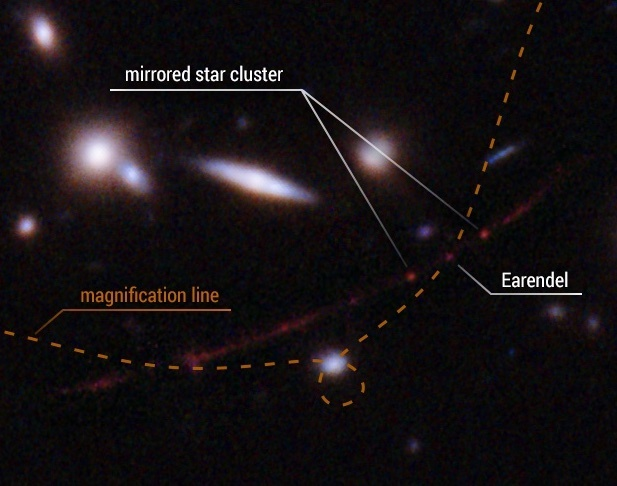
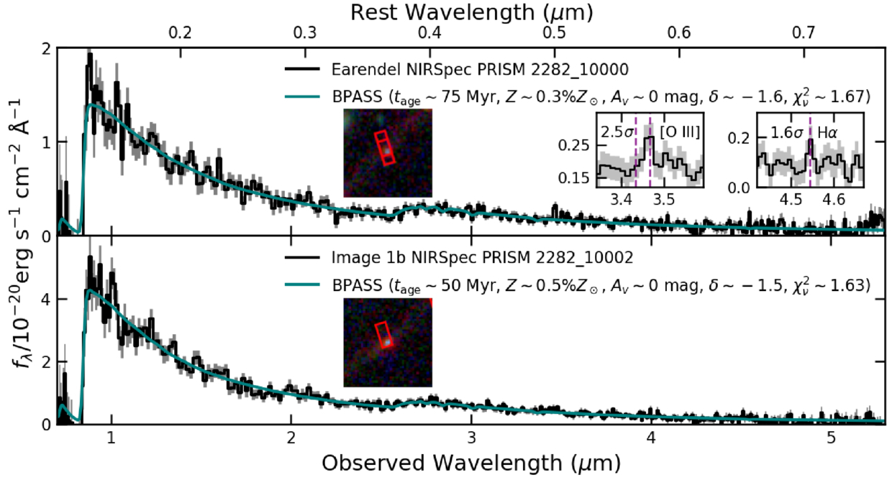
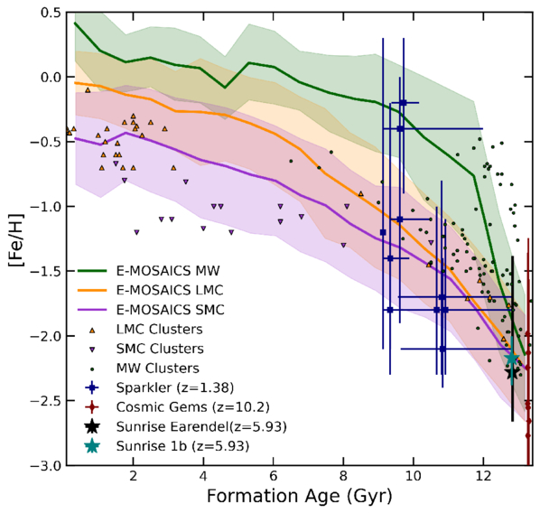

মহাকাশের সুদূর প্রান্তে আলোক বিন্দুর মতো জ্বলতে থাকা 'ইয়ারেন্ডেল' আসলে কী? মহাকর্ষীয় লেন্সিংয়ের প্রভাবে নাটকীয়ভাবে বিবর্ধিত একটি গ্যালাক্সির ভেতরে বিন্দুর মতো দেখতে পাওয়া আলোর এই উৎসটি নিয়ে বিজ্ঞানীদের কৌতূহল এখন তুঙ্গে।

**রেকর্ড গড়া আবিষ্কার**

২০২২ সালে হাবল স্পেস টেলিস্কোপ ব্যবহার করে জ্যোতির্বিজ্ঞানীরা মহাবিশ্বের সবচেয়ে দূরবর্তী নক্ষত্র সদৃশ এক বস্তুর সন্ধান পান, যার রেডশিফট ৫.৯২৬। ইয়ারেন্ডেল নামের এই নক্ষত্রটি মহাবিশ্ব জন্মের প্রথম ১০০ কোটি বছরের এক বিস্ময়কর আলোর উৎস, যা তার হোস্ট গ্যালাক্সি 'সানরাইজ আর্ক'-এর লালচে আভার মাঝেও উজ্জ্বলভাবে ফুটে উঠেছে।

তবে এখানে একটি কথা আছে—এত দূরের কোনো বস্তু আসলে একটি মাত্র নক্ষত্র নাকি অনেকগুলো নক্ষত্রের সমাহার, তা নির্ণয় করা সহজ নয়। সাম্প্রতিক এক গবেষণায় 'স্টেলার পপুলেশন মডেলিং' ব্যবহার করে খতিয়ে দেখা হয়েছে যে, যাকে আমরা একক নক্ষত্র হিসেবে জানি, তা আসলেই একটি তারকাপুঞ্জ বা ক্লাস্টার হতে পারে কি না।

সানরাইজ আর্ক এবং এয়ারেন্ডেল-এর ওপর জুম করা হাবলের ছবি। মিররড স্টার ক্লাস্টারের দুটি ছবিকে ‘১এ’ এবং ‘১বি’ বলা হচ্ছে। [নাসা, ইএসএ, ব্রায়ান ওয়েলচ (জেএইচইউ), ড্যান কো (এসটিএসসিআই); ইমেজ প্রসেসিং: অ্যালিসা প্যাগান (এসটিএসসিআই)]

**ইয়ারেন্ডেলের আলো: আমাদের প্রিয় নক্ষত্র নাকি তারকাপুঞ্জ?**

প্রশ্নটা শুনে খুব সাধারণ মনে হতে পারে: ইয়ারেন্ডেলের আলো কি একক কোনো নক্ষত্রের মতো, নাকি এটি অনেকগুলো নক্ষত্রের সমষ্টিগত নির্গমন? তবে বিষয়টিকে জটিল করে তুলেছে গ্র্যাভিটেশনাল লেন্সিং নামের একটি প্রক্রিয়া, যেখানে মাঝখানে থাকা একটি গ্যালাক্সি ক্লাস্টারের কারণে ইয়ারেন্ডেলের আলো বেঁকে এবং বিবর্ধিত হয়ে আমাদের কাছে পৌঁছায়। এই ম্যাগ্নিফিকেশনের নিখুঁত পরিমাপ জানা না থাকায়, ইয়ারেন্ডেলের প্রকৃত আকার নিশ্চিত করে বলা কঠিন। আর এই অনিশ্চয়তাই ইয়ারেন্ডেলের তারকাপুঞ্জ হওয়ার সম্ভাবনাকে বাঁচিয়ে রেখেছে।

ইউনিভার্সিটি অফ ক্যালিফোর্নিয়া, বার্কলির ম্যাসিমো প্যাসকেল এবং তার দল ইয়ারেন্ডেল ও সানরাইজ আর্কের অন্য একটি উৎস '১বি'-এর তথ্য বিশ্লেষণ করতে জেমস ওয়েব স্পেস টেলিস্কোপের ইনফ্রারেড স্পেক্ট্রোগ্রাফ থেকে পাওয়া স্পেকট্রা-তে একটি সাধারণ স্টেলার পপুলেশন মডেল ফিট করেন। '১বি' উৎসটি ব্যাপকভাবে একটি স্টার ক্লাস্টার হিসেবেই স্বীকৃত। এই মডেলে ক্লাস্টারটির বয়স, এর মেট্যালিসিটি, এর মধ্যে থাকা ধূলিকণার পরিমাণ এবং অন্যান্য বিষয়গুলো পরিবর্তন করে দেখা হয়েছে। মডেলিংকে আরও নিখুঁত করার জন্য গবেষক দলটি তিনটি ভিন্ন স্টেলার পপুলেশন মডেল লাইব্রেরি ব্যবহার করেছেন।

জেডব্লিউএসটি-তে পাওয়া ইয়ারেন্ডেল (উপরে) এবং ‘১বি’ (নিচে)-এর স্পেকট্রা, সাথে সবচেয়ে ভালোভাবে মিলে যাওয়া বেস্ট-ফিটিং মডেলগুলো। [প্যাসকেল এবং অন্যান্য, ২০২৫]

ইয়ারেন্ডেল এবং ‘১বি’—উভয়টিই এই তিনটি স্টেলার পপুলেশন মডেলেই বেশ ভালোভাবে ফিট করেছে, যা ইয়ারেন্ডেলের একটি ক্লাস্টার হওয়ার হাইপোথিসিস বা ধারণাকেই সমর্থন করে। ইয়ারেন্ডেল এবং ‘১বি’-এর মধ্যে বেশ কিছু মিল রয়েছে, যেমন: মেট্যালিসিটি (সূর্যের তুলনায় ১০ শতাংশেরও কম), স্টেলার সারফেস ডেনসিটি বা নক্ষত্রের পৃষ্ঠীয় ঘনত্ব (যা বেশ উচ্চ এবং আমাদের পারিপার্শ্বিক মহাবিশ্বে দেখা সর্বোচ্চ ঘনত্বের সাথে পাল্লা দেওয়ার মতো), এবং বয়স (৩ কোটি বা ৩০ মিলিয়ন বছরেরও বেশি)।

**ক্লাস্টারের তুলনা**

বৈজ্ঞানিক বিশ্লেষণ থেকে গবেষকরা ধারণা করেন, ইয়ারেন্ডেল ও '১বি' হতে পারে আজকের দিনের গ্লবুলার ক্লাস্টারের আদি রূপ। মহাবিশ্বে স্টার ক্লাস্টারগুলো কীভাবে সময়ের সাথে বদলায়, এরা হয়তো সেই একই চক্রের অংশ। আর এর মাধ্যমেই এদের সাথে অন্যান্য লেন্সড স্টার ক্লাস্টারের (যেমন: ১০.২ রেডশিফটের 'কসমিক জেমস ক্লাস্টার' বা ১.৪ রেডশিফটের 'স্পার্কলার ক্লাস্টার') একটি সরাসরি সম্পর্ক তৈরি হয়।

লোকাল ইউনিভার্স বা স্থানীয় মহাবিশ্বে, মিল্কিওয়ে এবং ম্যাগেলানিক ক্লাউডস-এ এবং হাই রেডশিফটে থাকা স্টার ক্লাস্টারগুলোর মেট্যালিসিটি বা ধাতবতা এবং সৃষ্টির বয়স। [প্যাসকেল এবং অন্যান্য, ২০২৫]

যদিও এই গবেষণা ইয়ারেন্ডেলকে একটি ক্লাস্টার হওয়ার জোরালো প্রমাণ দেয়, তবে এটি যে একক নক্ষত্র নয়, তা এখনই নিশ্চিত করে বলা যাচ্ছে না। বিজ্ঞানীদের মতে, যদি মাইক্রোলেন্সিংয়ের কারণে উজ্জ্বলতার হ্রাস-বৃদ্ধি লক্ষ্য করা যায়, তবেই একে একক নক্ষত্র হিসেবে চূড়ান্ত স্বীকৃতি দেওয়া সম্ভব হবে। এখন পর্যন্ত তেমন কোনো পরিবর্তন দেখা না যাওয়ায়, এর ক্লাস্টার হওয়ার ধারণাটি এখনও জোরালোভাবে টিকে আছে।

*Translated from ‘[Examining Earendel: Is the Most Distant Lensed Star Actually a Cluster](https://aasnova.org/2025/08/15/examining-earendel-is-the-most-distant-lensed-star-actually-a-cluster/#prettyPhoto)?,’ AAS Nova, 15 August 2025. Translation by Fariba Nehreen Binti in collaboration with AI.*
