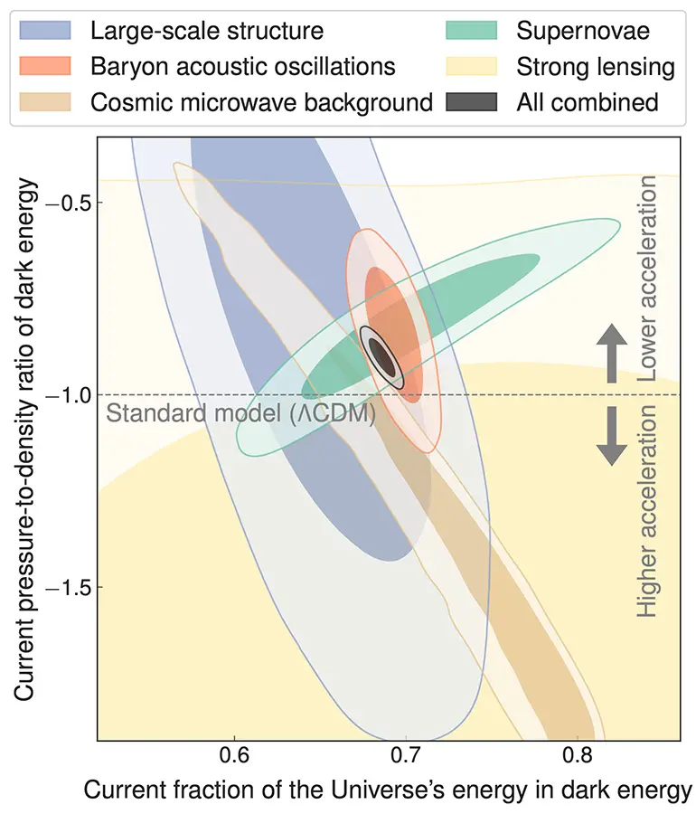

*যুক্তরাষ্ট্রের শিকাগো বিশ্ববিদ্যালয়ে আইনস্টাইন ফেলো এবং ইনডিপেনডেন্ট ইউনিভার্সিটি, বাংলাদেশের (আইইউবি) সেন্টার ফর এস্ট্রোনমি, স্পেস সায়েন্স এন্ড এস্ট্রোফিজিক্সের (কাসা) এসোসিয়েট মেম্বার আনোয়ার সজীব একই ইউনিভার্সিটির এমেরিটাস অধ্যাপক জশ ফ্রিম্যানের সাথে মিলে বিখ্যাত জার্নাল ফিজিকেল রিভিউ ডি-তে একটি গুরুত্বপূর্ণ পেপার পাব্লিশ করেছেন ডার্ক এনার্জি বিষয়ে। এতদিন পর্যন্ত সবচেয়ে প্রচলিত তত্ত্বে ডার্ক এনার্জিকে ধ্রুব ধরে নেয়া হতো, কিন্তু সজীবদের পেপার বলছে ডার্ক এনার্জির সম্ভবত পরিবর্তন হয়। এই পেপার নিয়ে [শিকাগো ইউনির ওয়েবসাইটে সজীব ও ফ্রিম্যানের একটি ইন্টারভিউ](https://physicalsciences.uchicago.edu/news/article/reconsidering-the-cosmological-constant/) প্রকাশিত হয়েছে যা আমরা নিচে বাংলায় প্রকাশ করছি।*

ডার্ক এনার্জি এমন জিনিস যার কারণে মহাবিশ্বের প্রসারণের হার বাড়ছে, এটা ইউনিভার্সের সবচেয়ে বড় রহস্যের একটা। বর্তমানের সবচেয়ে সমর্থিত তত্ত্বে ডার্ক এনার্জিকে ধ্রুব ধরে নেয়া হয়, এবং শূন্যস্থানের শক্তিকে বলা হয় মহাবিশ্বের ত্বরণের কারণ। কিন্তু গত বছর ডার্ক এনার্জি সার্ভে (ডেস) এবং ডার্ক এনার্জি স্পেক্ট্রোস্কপিক ইন্সট্রুমেন্ট (ডেসি) যখন ডার্ক এনার্জির বিবর্তন বা পরিবর্তনের দিকে ইঙ্গিত করে, তখন কসমোলজি কমুনিটিতে অনেক উদ্দীপনা তৈরি হয়। "এটাই হতে পারে আমাদের পাওয়া প্রথম নিদর্শন যে ডার্ক এনার্জি ১০০ বছর আগে আইনস্টাইনের বলা কসমোলজিকেল কন্সটেন্ট না, বরং অন্য রকমের এক ডায়নামিক পরিবর্তনশীল জিনিস," বলেছেন শিকাগো বিশ্ববিদ্যালয়ে এস্ট্রোনমি ও এস্ট্রোফিজিক্সের এমেরিটাস অধ্যাপক জশ ফ্রিম্যান।

ফিজিকেল রিভিউ ডি জার্নালে এই সেপ্টেম্বরে এক নতুন পেপার পাব্লিশ করেছেন ফ্রিম্যান এবং আনোয়ার সজীব। সজীব শিকাগো বিশ্ববিদ্যালয়ে নাসা হাবল ফেলোশিপ প্রগ্রামে এস্ট্রোনমি ও এস্ট্রোফিজিক্সের আইনস্টাইন ফেলো। এই পেপারে অনেক ধরনের প্রোব থেকে পাওয়া ডেটা সমন্বিত করে দেখানো হয়েছে, কসমোলজিকেল কন্সটেন্টের তুলনায় পরিবর্তনশীল ডার্ক এনার্জির ডায়নামিকেল মডেল দিয়ে এসব ডেটা বেশি ভালো ব্যাখ্যা করা যায়।

সজীবের মূল রিসার্চের বিষয় অব্জার্ভেশনাল কসমোলজি ও গ্যালাক্সির বিবর্তন, যার জন্য তিনি স্ট্রং গ্র্যাভিটেশনাল লেন্সিঙের মাধ্যমে হাবল ধ্রুবক মাপেন এবং ডার্ক এনার্জির প্যারামিটার সীমাবদ্ধ করেন। ফ্রিম্যান তার অব্জার্ভেশনাল কসমোলজি রিসার্চের অংশ হিসেবে স্লোন ডিজিটাল স্কাই সার্ভে (এসডিএসএস) এবং ডেস-এর মতো বড় বড় কসমিক সার্ভে কাজে লাগান, এবং এর মাধ্যমে মহাবিশ্বের উৎপত্তি ও বিবর্তন, আর বিশেষ করে ডার্ক এনার্জির প্রকৃতি বুঝার চেষ্টা করেন।

আমরা সজীব ও ফ্রিম্যানের সাথে কথা বলেছি তাদের পেপারে প্রকাশিত নতুন সব মডেল, এসব মডেলের তাৎপর্য, এবং তাদের ভবিষ্যৎ কাজ নিয়ে।

**মহাবিশ্বের গবেষণায় ডার্ক এনার্জি কেন গুরুত্বপূর্ণ?**

*ফ্রিম্যান*: আমরা এখন খুব সূক্ষ্মভাবে জানি মহাবিশ্বে কি পরিমাণ ডার্ক এনার্জি আছে, কিন্তু জানি না এটা ফিজিকেলি আসলে কি জিনিস। সবচেয়ে সরল হাইপোথিসিস বলে, এটা স্বয়ং শূন্যস্থানের এনার্জি, যা সময়ের সাথে পাল্টায় না। এই ধারণা শুরু হয়েছিল গত শতাব্দীর প্রথম দিকে আইনস্টাইন, ল্যমেত্র, ডি সিটার ও অন্যদের হাত ধরে। মহাবিশ্বের ৭০ পার্সেন্ট আসলে কি জিনিস তা নিয়ে আমাদের প্রায় কোনোই ক্লু নেই, ব্যাপারটা বেশ বিব্রতকর। এটা যাই হোক না কেন মহাবিশ্বের ভবিষ্যৎ বিবর্তনে অনেক গুরুত্বপূর্ণ ভূমিকা রাখবে।

**সাম্প্রতিক কি কি আবিষ্কারের কারণে বিজ্ঞানীরা ডার্ক এনার্জির বিবর্তন নিয়ে ভাবছেন?**

*সজীব*: নব্বইয়ের দশকে ডার্ক এনার্জির পরিবর্তনশীল প্রকৃতি আবিষ্কারের পর থেকেই অব্জার্ভেশনের বিভিন্ন অসঙ্গতি ব্যাখ্যার জন্য এটা ব্যবহার করা হচ্ছিল। তবুও বেশির ভাগ বড় ও নির্ভরযোগ্য ডেটা বিবর্তন-বিহীন ডার্ক এনার্জি মডেল দিয়েই ব্যাখ্যা করা যাচ্ছিল, এবং এসব মডেল স্ট্যান্ডার্ড কসমোলজি হিসেবে মেনে নেয়া হয়েছিল। কিন্তু গত বছর ডার্ক এনার্জির বিবর্তন নিয়ে নতুন করে অনেক আগ্রহ তৈরি হয় বেশ কয়েকটি পর্যবেক্ষণের কারণে, যার মধ্যে আছে সুপারনোভা, ব্যারিয়ন একস্টিক অসিলেশন, এবং ডেস ডেসি ও প্লাংকের কসমিক মাইক্রোওয়েভ ব্যাকগ্রাউন্ড ডেটা। এসব ডেটাসেট তুলনা করার পর ডার্ক এনার্জির বিবর্তনহীন মডেলের অসঙ্গতি আরো বেশি ধরা পড়ে। বিবর্তনহীন মডেলের ইন্টারেস্টিং ব্যাপারটা হচ্ছে, এক্ষেত্রে মহাবিশ্বের স্থানের প্রসারণ ঘটলেও ডার্ক এনার্জির ঘনত্ব পাল্টায় না। কিন্তু পরিবর্তনশীল ডার্ক এনার্জি মডেলে ডেন্সিটি পাল্টায়।

*ফ্রিম্যান*: এসব সার্ভের ডেটা ব্যবহার করে আমরা মহাবিশ্বের প্রসারণের ইতিহাস বুঝতে পারি, জানতে পারি ইতিহাসের বিভিন্ন সময়ে মহাবিশ্ব কি হারে প্রসারিত হচ্ছিল। ডার্ক এনার্জি ধ্রুব হলে এই ইতিহাস যেমন হবে পরিবর্তনশীল হলে তেমন হবে না। মহাবিশ্বের প্রসারণের ইতিহাস নিয়ে নতুন আবিষ্কার আমাদেরকে বলছে, গত কয়েক বিলিয়ন বছরের মধ্যে ডার্ক এনার্জির ডেন্সিটি প্রায় ১০ পার্সেন্ট কমেছে, এবং এই পরিবর্তন অন্য ধরনের পদার্থ বা শক্তির ঘনত্ব পরিবর্তনের চেয়ে কম হলেও খুব গুরুত্বপূর্ণ।

আমাদের পরিবর্তনশীল ডার্ক এনার্জির ফিজিক্সভিত্তিক মডেল এখানে সীমাবদ্ধ (কনস্ট্রেইন) করা হয়েছে বর্তমানের সব বড় কসমোলজিকেল সার্ভের মাধ্যমে। আমাদের রেজাল্ট কসমোলজির স্ট্যান্ডার্ড মডেলকে বাদ দিয়ে দিচ্ছে ৯৯.৬% লেভেলে। এর অর্থ মহাবিশ্বের ত্বরণের পরিমাণ আমাদের ধারণার চেয়ে কম।

**এই গবেষণার উদ্দেশ্য কি ছিল এবং সার্বিক রেজাল্ট কি?**

*সজীব ও ফ্রিম্যান*: এই গবেষণার লক্ষ্য ছিল পরিবর্তনশীল ডার্ক এনার্জির একটি ভৌত মডেলের বিভিন্ন প্রেডিকশন সর্বশেষ সব ডেটাসেটের সঙ্গে তুলনা করা এবং এই তুলনা থেকে ডার্ক এনার্জির ভৌত বৈশিষ্ট্য নির্ণয় করা। অতীতে অধিকাংশ ডেটা বিশ্লেষণে ব্যবহার করা পরিবর্তনশীল ডার্ক এনার্জির “মডেল” ছিল কেবল একটা গাণিতিক সূত্র, যা ভৌত মডেলের মতো আচরণ করত না। আমাদের পেপারে আমরা সরাসরি ফিজিক্স-ভিত্তিক বিভিন্ন পরিবর্তনশীল ডার্ক এনার্জি মডেল তুলনা করেছি ডেটার সঙ্গে এবং দেখেছি যে এই মডেলগুলো বর্তমান ডেটাকে প্রচলিত অপরিবর্তনশীল ডার্ক এনার্জি মডেলের তুলনায় ভালোভাবে বর্ণনা করে। আমরা এটাও দেখিয়েছি যে অদূর ভবিষ্যতে ডেসি এবং ভেরা রুবিন অব্জার্ভেটরি লেগেসি সার্ভে অব স্পেস অ্যান্ড টাইমের (এলএসএসটি) মতো সার্ভেগুলো আমাদেরকে চূড়ান্তভাবে জানাতে সক্ষম হবে যে এই মডেলগুলো ঠিক নাকি ডার্ক এনার্জি আসলেই ধ্রুব।

**মডেলগুলোর কথা বলুন: তারা কেন আগের মডেলের তুলনায় ডার্ক এনার্জির আচরণ ভালোভাবে ব্যাখ্যা করে?**

*ফ্রিম্যান*: এই মডেলগুলো তৈরি হয়েছে পার্টিকেল ফিজিক্সের সেসব থিওরির উপর ভিত্তি করে যেখানে “এক্সিয়ন” নামের কাল্পনিক কণার কথা বলা হয়। পদার্থবিদরা এক্সিয়ন প্রেডিক্ট করেছিলেন ১৯৭০-এর দশকে স্ট্রং ইন্টারেকশনের পর্যবেক্ষণ করা কিছু বৈশিষ্ট্য ব্যাখ্যা করতে গিয়ে। বর্তমানে এক্সিয়নকে ডার্ক ম্যাটারের সম্ভাব্য ক্যান্ডিডেট হিসেবে ধরা হয়, আর সারা বিশ্বের গবেষকরা এদের খোঁজ করছেন সক্রিয়ভাবে, যার মধ্যে ফার্মিল্যাব আর ইউনিভার্সিটি অফ শিকাগোর পদার্থবিদরাও আছেন।

আমাদের প্রবন্ধে যেসব মডেল ব্যবহার করা হয়েছে সেগুলো এক্সিয়নের অন্যরকম এক অতিলঘু ভার্সনের উপর ভিত্তি করে তৈরি, যা ডার্ক ম্যাটার নয় বরং ডার্ক এনার্জি হিসেবে কাজ করবে। এসব মডেলে ডার্ক এনার্জি মহাজাগতিক ইতিহাসের প্রথম কয়েক বিলিয়ন বছর আসলেই ধ্রুব ধরা হয়, কিন্তু পরে এক্সিয়নের বিবর্তন শুরু হয়, অনেকটা যেমন ঢালু ভূমিতে স্থির অবস্থান থেকে ছেড়ে দেয়া একটি বল গড়িয়ে নিচে পড়তে শুরু করে। এভাবে ধীরে ধীরে এক্সিয়নের ঘনত্ব কমতে থাকে, যা ডেটার সাথে বেশ ভালো খাপ খায়। অর্থাৎ ডেটা প্রকৃতিতে এমন এক অজানা কণার দিকে ইঙ্গিত করছে যা ইলেক্ট্রনের চেয়ে ৩৮ অর্ডার-অফ-ম্যাগ্নিচুড হালকা।

**মহাবিশ্বের প্রসারণ বুঝার ক্ষেত্রে আপনাদের আবিষ্কারের তাৎপর্য কি?**

*সজীব*: এসব মডেলে ডার্ক এনার্জির ঘনত্ব সময়ের সঙ্গে সঙ্গে কমতে থাকে। ডার্ক এনার্জিই মহাবিশ্বের ত্বরিত সম্প্রসারণের কারণ, তাই যদি এর ঘনত্ব কমে যায়, তবে সেই ত্বরণও সময়ের সাথে কমে আসবে। যদি আমরা মহাবিশ্বের সুদূর ভবিষ্যৎ কল্পনা করি, তাহলে ডার্ক এনার্জির ভিন্ন ভিন্ন বৈশিষ্ট্য ভিন্ন ভিন্ন পরিণতি ঘটাতে পারে। এই পরিণতির দুই প্রান্ত হলো, একদিকে বিগ রিপ, যেখানে ত্বরিত সম্প্রসারণ এতটাই বেড়ে যায় যে তা শেষ পর্যন্ত সবকিছু ছিঁড়ে ফেলে, এমনকি পরমাণুকেও। আরেকদিকে বিগ ক্রাঞ্চ, যেখানে কোনো এক পর্যায়ে মহাবিশ্বের সম্প্রসারণ থেমে গিয়ে আবার ভেঙে পড়বে, মহাবিশ্ব সংকুচিত হতে শুরু করবে, অনেকটা উল্টা বিগব্যাঙের মতো। আমাদের মডেল ইঙ্গিত দিচ্ছে, মহাবিশ্ব এই দুই চরম অবস্থাই এড়িয়ে যাবে, এড়িয়ে বহু বিলিয়ন বছর ধরে ত্বরিত সম্প্রসারণের মধ্য দিয়ে মহাবিশ্ব শেষ পর্যন্ত হবে শীতল, অন্ধকার। এই পরিণতির নাম বিগ ফ্রিজ।

**এই রেজাল্টের কি আরো এমন তাৎপর্য থাকতে যা এখনো স্পষ্ট না?**

*ফ্রিম্যান*: আমার মনে যে একমাত্র ব্যবহারিক তাৎপর্য আসছে তা হলো আরো গবেষণার জন্য প্রয়োজনীয় প্রযুক্তি, যা আমাদেরকে ভবিষ্যতে তৈরি করতে হবে, মানে নতুন টেলিস্কোপ, নতুন স্যাটেলাইট, বা অভিনব ডিটেক্টর। এসব উন্নয়ন আমাদের জীবনে যে প্রভাব ফেলবে তা ভবিষ্যতের ট্রিলিয়ন বছর পর ঘটা ঘটনার চেয়ে অবশ্যই অনেক বেশি।

**এসব রেজাল্টের মধ্যে কি নিয়ে আপনাদের উচ্ছ্বাস সবচেয়ে বেশি?**

*সজীব*: এই পেপারের জন্য আমরা বড় বড় সব ডেটাসেট একত্র করেছি, ডেস, ডেসি, এসডিএসএস, টাইম-ডিলে কসমোগ্রাফি, প্লাংক, আর আটাকামা কসমোলজি টেলিস্কোপ। এবং এসব মিলিয়ে আমরা এখন পর্যন্ত ডার্ক এনার্জির সবচেয়ে সীমাবদ্ধ পরিমাপটি পেয়েছি। এই পরিমাপের পিছনে আছে অনেক এক্সপেরিমেন্টের রেজাল্ট, তাই এক অর্থে এটা হলো কসমোলজি কমুনিটির সম্মিলিত জ্ঞানের প্রতিফলন।

*ফ্রিম্যান*: আমরা যখন ২০০৩ সালে ডেস নিয়ে কাজ শুরু করি, তখন আমাদের লক্ষ্য ছিল ডার্ক এনার্জির বৈশিষ্ট্য সীমাবদ্ধ করা, এটা ধ্রুব নাকি পরিবর্তনশীল তা নির্ধারণ করা। দুই দশক ধরে ডেটা বলছিল যে এটা ধ্রুব। আমরা সেই প্রশ্নটা প্রায় ছেড়েই দিচ্ছিলাম, কারণ ডেটা বারবার সেই অনুমানকেই সমর্থন করছিল। কিন্তু এখন ২০ বছরের বেশি সময় পর প্রথমবার আমরা এমন ইঙ্গিত পাচ্ছি যে ডার্ক এনার্জি হয়ত পরিবর্তনশীল। এই বিবর্তন সত্য হলে আমাদের এই রেজাল্ট মৌলিক ফিজিক্স নিয়ে আমাদের কিছু চিন্তা পাল্টে যাবে। এই অনুভূতি অনেকটা শুরুর সময়ের মতো। অবশ্যই এখনো হতে পারে যে এসব ইঙ্গিত ভুল, কিন্তু আমরা হয়ত সেই প্রশ্নের উত্তর খুঁজে বের করার একেবারে দ্বারপ্রান্তে আছি; আর এটাই নিঃসন্দেহে সবচেয়ে উচ্ছ্বাসের বিষয়।

[এই অনুবাদে চ্যাটজিপিটি'র কিছুটা সাহায্য নেয়া হয়েছে।]
