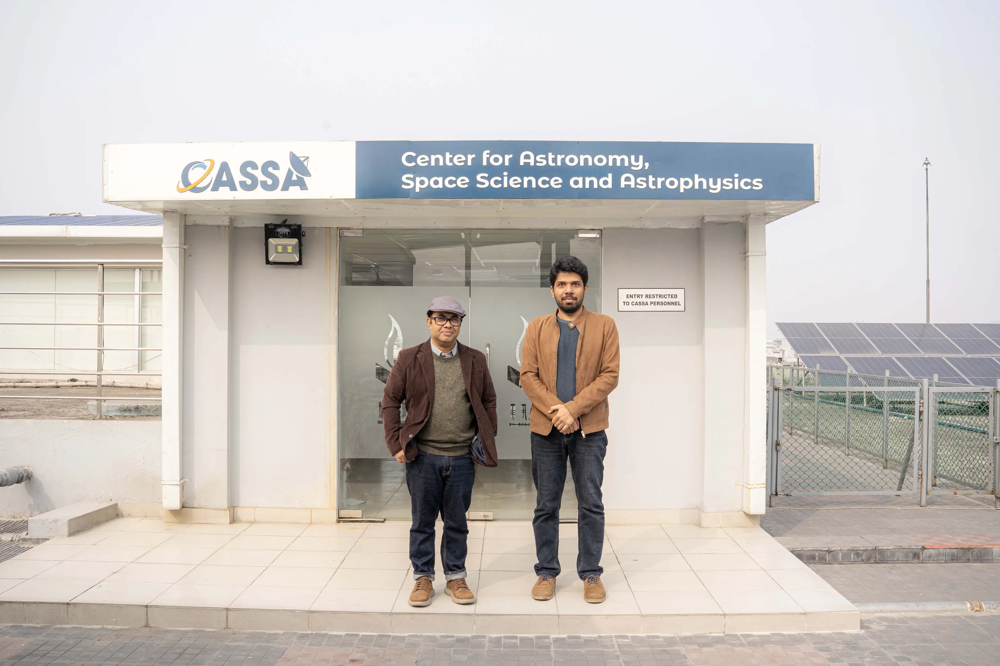

Independent University, Bangladesh (IUB) proudly announces the appointment of **Dr. Syed Ashraf Uddin** as an Associate Professor within the Department of Physical Sciences, effective January 2026. Joining the department's Astrophysics Group, Dr. Uddin is poised to elevate the university's academic curriculum and research excellence. Beyond his teaching duties, he will serve as a core member of IUB’s Center for Astronomy, Space Science and Astrophysics (CASSA)—a research hub he played a foundational role in establishing to catalyze astrophysics research within Bangladesh.

Dr. Uddin brings over two decades of distinguished global experience in observational astronomy and cosmology to the IUB faculty. His illustrious career features tenures as an Astronomer for the **US Naval Observatory** in Washington, DC, and as a resident astronomer for the **Hobby-Eberly Telescope** at the McDonald Observatory in Texas, USA. He has held prestigious research appointments as a Postdoctoral Fellow at the **Carnegie Observatories** of the Carnegie Institution of Washington and as a Postdoctoral Research Associate at **Texas A&M University**. His international stature is further underscored by his selection as a President’s International Fellow of the **Chinese Academy of Sciences** at the Purple Mountain Observatory, where he contributed to the Antarctic astronomy project.

An influential scientist in supernova cosmology, Dr. Uddin is recognized for his sustained and significant impact on the global scientific community. His research, centered on the cosmic distance scale and the expansion rate of the Universe, represents a pivotal endeavor in addressing the global "Hubble Tension." Notably, he has spearheaded studies in collaboration with the **Carnegie Supernova Project** to measure the Hubble constant using diverse distance calibrators. His expertise in this domain resulted in his invitation to join a team of experts, led by Nobel laureate **Adam Riess**, tasked with establishing a global consensus on the Hubble constant through a cosmic distance network.

Dr. Uddin has played important roles in the realm of time-domain astronomy, particularly within the **Dark Energy Survey** and the **Australia-China Consortium for Astrophysical Research**. His contributions range from the mastery of observing strategies and data reduction to active participation in the dissemination of Astronomer’s Telegrams. He co-led spectroscopic follow-ups of astronomical transients using the Wide Field Spectrograph on the 2.3-m ANU telescope as part of the Antarctic Schmidt Telescope collaboration, a testament to his dynamic engagement in impactful global research collaborations.

His impressive scholarly output comprises 64 refereed papers, garnering over 5,600 citations as documented in the NASA [Astrophysics Data System](https://ui.adsabs.harvard.edu/public-libraries/dSbn4MnSSFyrap6MEk0_ug). With a professional h-index of 33 and a g-index of 63, his research is frequently featured in premier journals, including *The Astrophysical Journal* and *Monthly Notices of the Royal Astronomical Society*. Furthermore, his work probes the nature of Dark Energy by investigating the intricate relationship between Type Ia Supernovae and their host galaxies.

Dr. Uddin’s academic pedigree is equally remarkable, with an intellectual lineage tracing back to iconic figures such as Arthur Eddington, Jan Oort, and Lyman Spitzer. He earned his PhD in Astrophysics from **Swinburne University of Technology**, Australia, under the supervision of Professor Jeremy Mould, following an M.Sc. in Physics from the University of Kentucky, USA, and an M.Sc. in Radio Astronomy and Space Science from Chalmers University of Technology, Sweden. He initially graduated with a B.Sc. in Mechanical Engineering from the Bangladesh University of Engineering and Technology.

At IUB, Dr. Uddin will be vital to shaping the next generation of scientists and engineers by teaching courses for the Minor in Astronomy and Astrophysics (A&A). He will also instruct the general education course AST 100: Our Cosmic History, demystifying complex astronomical concepts for a broader student body. In collaboration with Dr. Khan Muhammad Bin Asad, he will spearhead the proposal for a Master of Science program in A&A at IUB, which will be accessible to all prospective students in Bangladesh. His extensive teaching portfolio encompasses both online and in-person instruction at the American Public University System, the University of South Carolina, and Santa Monica College.

Dr. Uddin aims to establish a robust research group at IUB, fostering international collaboration in supernova cosmology and time-domain multi-messenger astronomy. His research will primarily leverage data from several telescopes at the **Las Campanas Observatory** and the **Rubin Observatory’s Legacy Survey of Space and Time**. Dr. Uddin is dedicated to implementing automated transient follow-up systems and advocating for a research-grade optical observatory equipped with a meter-class telescope. He intends to actively involve both undergraduate and graduate students in his research endeavors and looks forward to collaborating with the entire IUB community.

*Dr. Uddin (left) and Dr. Asad (right) in front of the CASSA Office at IUB, 4 January 2026.*
