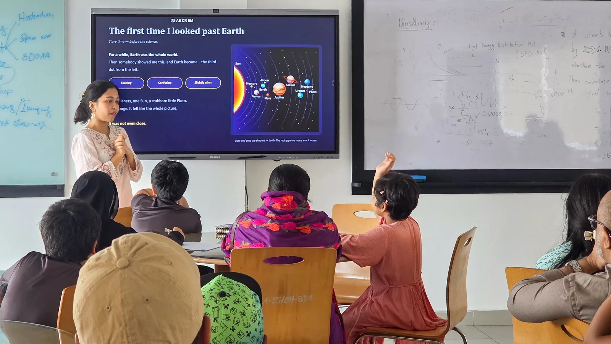
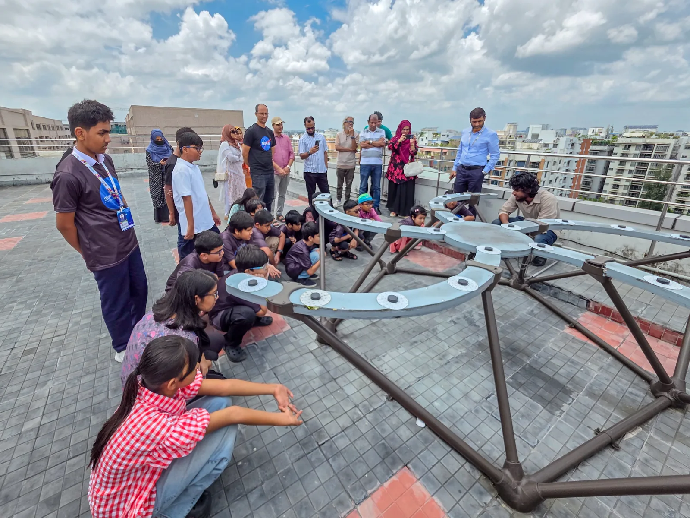
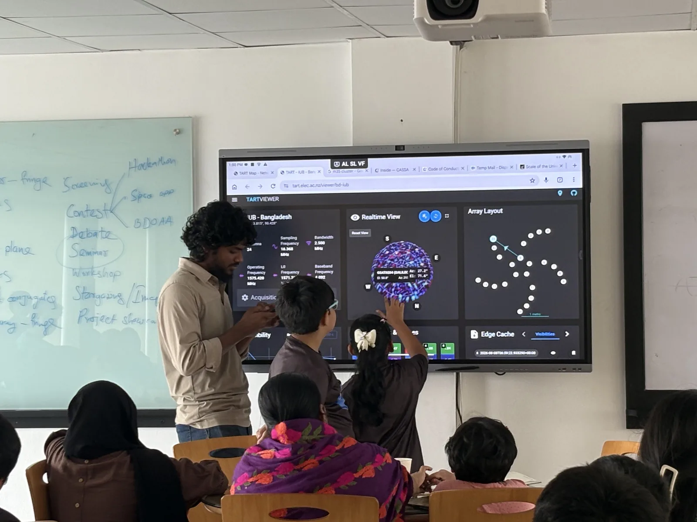
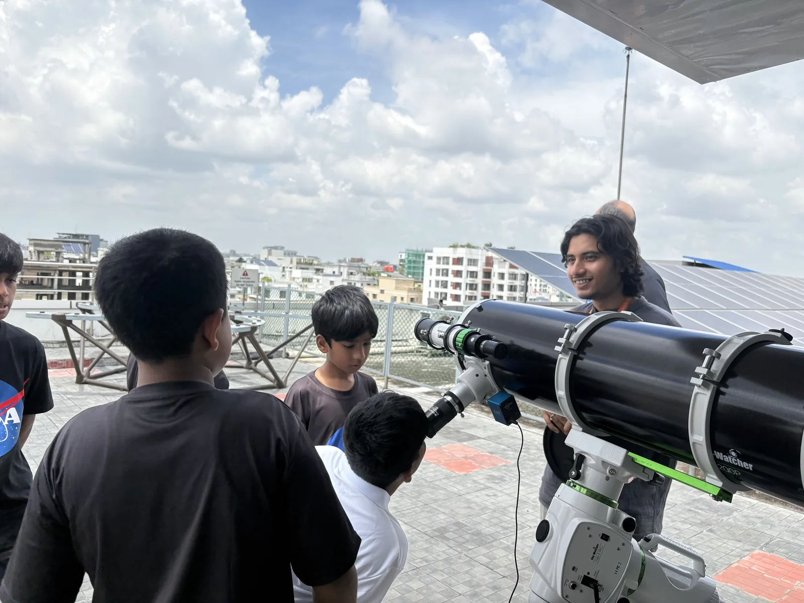
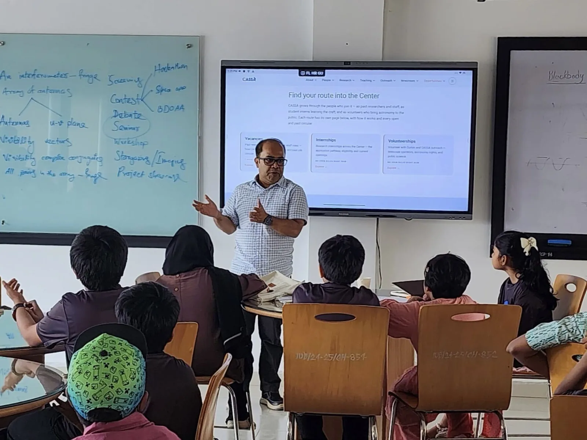

At noon on August 8, CASSA was bustling with the particular chatter of children who have just been told they are about to look through a telescope. They came from Space Innovation Camp, ranging in age from seven to thirteen, and for most of them this was a first visit to a working astronomy center. As the children settled, Dr. Syed Ashraf Uddin stepped forward to welcome them. He kept his introduction simple, just enough to set the stage, before letting the day itself do the talking. By the time they left, they had looked at the sky in three very different ways: as a matter of scale, as an invisible signal, and as a point of light bent through glass.

The day opened indoors, where CASSA intern Farhana Ferdous led *Cosmic Scale: How Big Is the Universe?* Before showing anything, she began with a memory: the first time she truly understood the size of the universe was while staring at a picture of the solar system back in grade six. Then she asked the room a simple question — how big do you think the universe actually is? — and let the guesses run for a while before turning to the Scale of the Universe website to show them. Starting from a single person, then a house, the view pulled back through planets, then stars, then galaxies, each step dwarfing the one before it. It's a simple trick, zooming out, but it rarely fails: the questions came fast and mostly unprompted, and the room stayed loud in the way rooms get loud when nobody in it is bored.

*CASSA intern Farhana Ferdous opens Cosmic Scale — “the first time I looked past Earth” — before the view zooms out from a single person to the edge of the observable universe.*

From scale, the day moved to something harder to picture: light that can't be seen at all. In *Unclouding the Sky with an Array Radio Telescope*, CASSA intern M.O.B. Jihad introduced the students to radio astronomy — the idea that the sky overhead is constantly sending down signals that have nothing to do with the light our eyes catch, and that gathering them takes a different kind of instrument: many small antennas, working as one. The questions started before anyone even went outside. If our eyes can't see it, how do we know it's there? What does an instrument “see” that we don't?

Then the group filed out onto the rooftop, to where CASSA's TART radio telescope sits beside the office — a 24-antenna array that made Bangladesh's first radio-astronomy detection in 2025. Up close, it looks nothing like the telescopes children usually draw: no tube, no eyepiece, just a spiral of small receivers on a metal frame, pointed at the whole sky at once instead of one patch of it.

*Students gather around CASSA's TART radio telescope — the same 24-antenna array that made Bangladesh's first radio-astronomy detection in 2025.*

Back inside, Jihad pulled up TARTviewer, the array's live interface, and set the students a small challenge: find the Sun — not by looking up, but by reading the signal. Hands went up to the screen, tracing the live feed as it filled in, and when a bright point resolved into position, a few of them had genuinely found it themselves. It was a small win, technically, but it landed like a big one — the kind of moment that had the guardians in the room reaching for their phones too. That, in its own quiet way, was one of the nicest parts of the day: the guardians hadn't just dropped their children off. They stood right there through every session, seeing exactly what CASSA does and what their children could go on to do here — parents and children, for a moment, watching the same distant signal resolve on the same screen at the same time.

*Indoors, TARTviewer traces the array's live feed as students search the data for the Sun — a search a few of them won on their own.*

Later, CASSA research assistant Md Shahadat Hossain Shahal brought the day back to something more familiar: a telescope with an eyepiece to lean into. Out on the open rooftop, students and guardians took turns at CASSA's 8-inch Skywatcher, several of the smaller campers needing a boost to reach it. It was broad daylight, and without a solar filter on hand, pointing it at the Sun wasn't an option — so the telescope was turned toward the distant rooftops instead, close enough to make the point safely: this is what magnification does, and this is how much closer a telescope can pull something that's genuinely far away. It stood in for the real thing, but usefully — the same optics that shrink a skyline into an eyepiece are the optics that, after dark, do the same to the Moon and the planets.

*Students get a first look through CASSA's 8-inch Skywatcher — a daytime preview, aimed at the skyline, of what the same optics reveal after sunset.*

Before the students left, Dr. Syed Ashraf Uddin, Associate Professor at IUB, closed the day with a session — not about the universe this time, but about CASSA itself. He walked the room through what the Center offers past the age of thirteen: vacancies, internships, volunteerships.

*Dr. Syed Ashraf Uddin, Associate Professor at IUB, closes the visit by walking students and guardians through CASSA's vacancies, internships, and volunteerships.*

At one point, a volunteer turned to the audience and asked, almost in passing, if anyone knew what Halley's Comet was. For a moment, nothing. Then, from somewhere near the front, a single tiny hand shot straight into the air, attached to a girl who could not have been older than class one. “I do,” she said, before anyone could even call on her, and then she simply kept going, explaining without a hint of hesitation that the comet appears only once every 76 years and would not be seen again until 2061. The room went completely silent for a beat, and then it did not stay silent for long, breaking instead into applause, the kind that comes not from politeness but from pure, startled delight. Nobody in that room had walked in expecting to be taught something by the smallest person in it, and yet there it was. That single moment said more about the day than any summary ever could.
