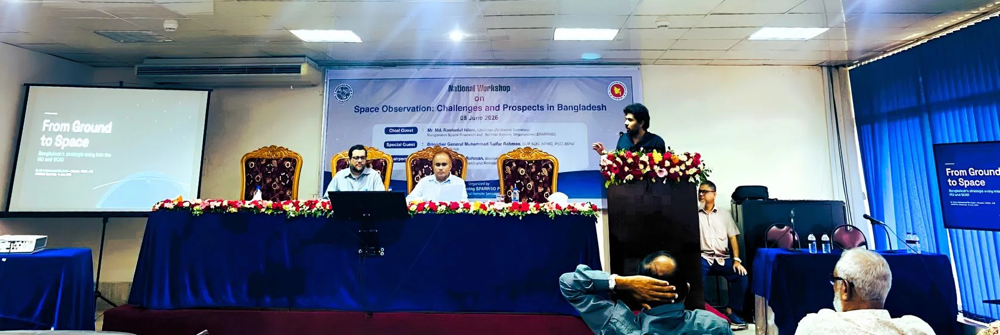

Scientists, officials and students gathered at the SPARRSO Auditorium in Agargaon, Dhaka, on 8 June 2026 for the national workshop "Space Observation: Challenges and Prospects in Bangladesh," organized by the Strengthening SPARRSO Project of the Bangladesh Space Research and Remote Sensing Organization (SPARRSO). Running from morning to mid-afternoon, the day-long event brought together SPARRSO personnel alongside participants from various universities and government institutions to weigh where Bangladesh stands in observing the sky — and how far it can go.

The workshop opened with a welcome address from the Project Director of the Strengthening SPARRSO Project, followed by remarks from a line-up of distinguished guests. Brigadier General Muhammad Saifur Rahman, SUP, NDC, AFWC, PSC, MPhil, of the Ministry of Defence spoke as Special Guest; Mr. Md. Rashedul Islam, Chairman (Additional Secretary) of SPARRSO, addressed the gathering as Chief Guest (pictured above); and Dr. Md. Mahmudur Rahman, Member (Technology) of SPARRSO, spoke as Chair. Their addresses set the tone for the day, underscoring the national importance of building indigenous capacity in space science and remote sensing.

After a light-refreshment break, the technical session opened with the keynote programme. Dr. Shahnewaz Siddique, Associate Professor at North South University, spoke on the conceptual design of space-observation CubeSats and the possibilities they open for Bangladesh; Md. Naim Islam Talukder, Scientific Officer at SPARRSO, shared insights from the organization's own amateur astronomical observation facilities; and Dr. Khan Muhammad Bin Asad, Assistant Professor in the Department of Physical Sciences at Independent University, Bangladesh (IUB), delivered the astrophysics keynote, "From Ground to Space: Astrophysics and Space Science for Bangladesh's Strategic Entry into the IAU and SKAO."

The centrepiece of the astrophysics part of the workshop was Dr. Asad's keynote. As a core member of the Center for Astronomy, Space Science and Astrophysics (CASSA) at IUB, he made a simple but ambitious case: Bangladesh has long looked down at the Earth through remote sensing, and the moment has now come to also look out at the cosmos. He introduced CASSA as an autonomous research center established at IUB in 2025 and built on three pillars — research, teaching and outreach. Far from a paper proposal, he stressed, the center is already operating, with roughly 35 people, its own high-performance computer named Timaeus, and published work reaching international journals.

*Dr. Khan Muhammad Bin Asad delivers the astrophysics keynote “From Ground to Space” at the SPARRSO national workshop.*

At the heart of the talk was a "ground-to-space synthesis" — the idea that a full picture of the universe requires observing it across the spectrum. The ground reveals the radio universe while space reveals the high-energy universe, and only together do they tell the complete story. To that end, Dr. Asad presented Bangladesh's first Transient Array Radio Telescope (TART), an open-source instrument developed by Dr. Tim Molteno and his group at University of Otago, New Zealand. Its array layout was built locally at the IUB Fab Lab, while the electronics were imported from New Zealand. Dr. Molteno himself travelled to Bangladesh to oversee the installation, which was carried out by Fab Lab staff together with participants of the second CASSA workshop. Through it, Bangladesh joins a worldwide network of TART sites spanning Africa, Oceania, Asia and now Europe, placing the country — alongside Sweden — among the network's northern nodes and sharing data and expertise across the globe.

He traced his own scientific journey as evidence of the expertise already in place. His doctoral work with the LOw Frequency ARray (LOFAR) sought the faint radio "whisper" from cosmic dawn, buried beneath contamination that mimics the signal, which he learned to measure. His postdoctoral work with MeerKAT (Karoo Array Telescope, KAT, with the Afrikaans prefix "meer," meaning "more"), a radio telescope in South Africa, modelled the blurry "beam" of each antenna for efficient use in wide-field science. He described how black-hole jets bend in dense cluster gas to act as natural "weathervanes" of the cosmos, and how a student-led, deep-learning classifier developed in Bangladesh sorts some 22,000 radio sources by jet shape, run on Timaeus and published internationally. Tying the threads together, he showed how the orbiting Chandra X-ray Observatory maps the hot cluster gas that bends those very jets — the radio and X-ray views combining into a single physical story of galaxy clusters.

Throughout, Dr. Asad framed CASSA and SPARRSO as two halves that could together form a single national capability: SPARRSO as the public hub for space sciences — spanning Earth, space and astronomical observation alike — with public funding and facilities, and CASSA as the private hub, contributing expert scientists, computing power and a growing student base. This multi-wavelength, multi-institution approach, he argued, is the natural foundation for Bangladesh's next step. With the scientific pieces now in place, he laid out a roadmap toward professional membership in the International Astronomical Union (IAU), the global home of astronomy, and the Square Kilometre Array Observatory (SKAO), the world's largest radio telescope. The country's "entry ticket," he noted, already exists in the form of hands-on experience with TART, LOFAR, MeerKAT and its own computing infrastructure, all of which build SKA-ready skills today.

His roadmap called for expanded collaborations and funding, a graduate programme at IUB, and the growth of a national space economy, all supported by an ecosystem linking universities, SPARRSO and observatories. A concrete first step, he suggested, would be a standing CASSA–SPARRSO link, alongside continued investment in people through teaching, olympiads and public outreach. "Bangladesh looks down — now also out," he told the audience. "The science works, the people are here, and IAU and SKAO membership is within reach this decade."

The keynote captured the workshop's central message: that Bangladesh's future in space observation lies not in choosing between Earth observation and astrophysics, but in bringing the two together. As the day's speakers made clear — from CubeSat design at North South University, to astrophysics at IUB, to SPARRSO's own observation facilities — the country now has both the institutions and the talent to take its place in the global space-science community. A panel discussion and closing remarks from the Project Director brought the day to a close.
